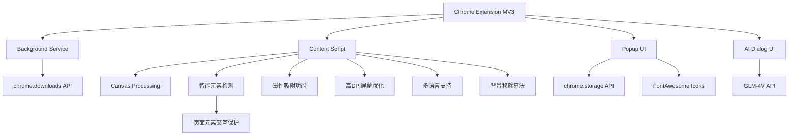

# 精准截图 - AI时代的首款智能截图工具

简体中文 | [English](README_EN.md) | [繁體中文](README_ZH_TW.md) | [日本語](README_JA.md) | [한국어](README_KO.md) | [Français](README_FR.md) | [Deutsch](README_DE.md) | [Español](README_ES.md)

## 项目概述
"精准截图"是一款Chrome浏览器插件，旨在解决用户在网页截图时需要频繁调整截图区域比例的问题。该插件允许用户预先设定截图比例，然后进行连续截图操作，每次截图都会自动保持所选比例，大大提高截图效率。该插件界面美观，操作简单，适合各类用户使用。


## 快速开始

### 1. 安装
- **Chrome应用商店安装**
  - 访问 [Chrome应用商店 - 精准截图](https://chromewebstore.google.com/detail/%E7%B2%BE%E5%87%86%E6%88%AA%E5%9B%BE-%E4%B8%80%E9%94%AE%E6%99%BA%E8%83%BD%E7%B2%BE%E5%87%86%E6%88%AA%E5%9B%BE%E5%B7%A5%E5%85%B7/mebflgmmheidlmggndpkkodonedongin?authuser=0&hl=zh-CN)
  - 点击"添加至Chrome"按钮完成安装

- **开发者模式安装**
  - 下载本项目代码并解压
  - 打开Chrome浏览器，访问 `chrome://extensions/`
  - 开启右上角的"开发者模式"
  - 点击"加载已解压的扩展程序"，选择解压后的文件夹

### 2. 基本使用
1. **启动截图**
   - 点击浏览器工具栏中的精准截图图标
   - 或使用快捷键 `Ctrl+Shift+S`

2. **选择截图模式**
   - 普通模式：选择预设比例（1:1、16:9等）
   - 智能模式：自动识别网页元素边界

3. **截图操作**
   - 鼠标点击并拖动选择区域
   - 调整大小：拖动边框或角落的调整点
   - 移动位置：拖动选区中心区域
   - 确认截图：点击工具栏的"保存"按钮或按Enter键
   - 取消截图：按Esc键

### 3. 进阶功能
- **磁性吸附**：靠近元素边缘时自动吸附，便于精确选择
- **锁定尺寸**：批量截取相同大小的图片
- **二维码解析**：识别并复制二维码内容
- **AI对话**：与截图内容进行智能对话
- **背景移除**：一键去除图片背景
- **快速分享**：一键分享截图到社交媒体
- **快速反馈**：提供产品使用反馈

### 4. 快捷键
- `Ctrl+Shift+S`：启动截图
- `Enter`：确认截图
- `Esc`：取消截图
- `Ctrl+C`：复制截图到剪贴板

## 目标用户
- 设计师：需要获取特定比例的素材
- 内容创作者：需要为不同平台准备固定比例的图片
- 电商卖家：需要制作统一规格的产品图片
- 社交媒体运营：需要为不同平台准备符合规格的图片

## 核心功能
### 1. 比例设置
- ✅ 预设常用比例，按分组整理：
  - 常用比例：16:9 (视频/屏幕)、4:3 (传统屏幕)、1:1 (正方形/Instagram)
  - 移动设备：9:16 (手机竖屏/故事)、3:4 (小红书/iPad)
  - 社交媒体：2:1 (小红书/Twitter横图)、1:2 (Pinterest)、4:5 (Instagram竖图)、3:2 (SNS封面)
  - 其他：21:9 (超宽屏)、自由比例
- ✅ 支持用户自定义比例输入
- ✅ 记住用户最近使用的比例设置
- ✅ 支持自由比例模式

### 2. 截图操作
- ✅ 用户选择比例后进入截图模式
- ✅ 截图区域自动保持所选比例
- ✅ 支持拖拽调整截图区域大小（保持比例不变）
- ✅ 支持移动截图区域位置
- ✅ 显示当前截图区域的尺寸信息
- ✅ 支持连续截图，无需退出截图模式即可截取多张图片
- ✅ 智能元素检查模式，自动识别网页元素边界
- ✅ 支持锁定截图尺寸，方便批量截取相同大小的图片
- ✅ 支持二维码解析，一键识别并复制链接

### 3. 智能检测功能
- ✅ 智能识别页面元素边界
- ✅ 悬停时自动高亮显示元素尺寸
- ✅ 点击即可精准截取UI组件
- ✅ 支持元素中心线对齐
- ✅ 智能过滤不可见元素
- ✅ 智能截图模式下防止与页面元素交互，保护截图状态不被破坏

### 4. 磁性吸附功能
- ✅ 自动吸附到页面元素边缘
- ✅ 可调整吸附强度
- ✅ 支持水平和垂直方向吸附
- ✅ 智能吸附阈值控制
- ✅ 平滑过渡动画效果

### 5. 图片保存
- ✅ 支持将截图保存到本地
- ✅ 支持复制到剪贴板
- ✅ 支持连续截取的多张图片预览
- ✅ 可自定义图片格式（PNG/JPG）和质量
- ✅ 支持高DPI屏幕优化

### 6. 二维码功能
- ✅ 一键解析截图中的二维码
- ✅ 自动复制二维码链接到剪贴板
- ✅ 支持各种常见二维码格式
- ✅ 智能识别和定位二维码位置
- ✅ 清晰的成功/失败状态提示

### 7. AI图像对话
- ✅ 一键启动AI对话模式，与截图内容进行对话
- ✅ 基于GLM-4V大模型的图像理解能力
- ✅ 支持用户提问和多轮对话
- ✅ 可询问图像内容、文字解释、代码分析等
- ✅ 简洁美观的对话界面，支持Markdown格式显示

### 8. 背景移除
- ✅ 一键移除图像背景，生成透明背景图片
- ✅ 内置简单的背景分析算法
- ✅ 适用于产品、物体等简单背景图像
- ✅ 处理完成后直接复制到剪贴板
- ✅ 保留前景对象的清晰边缘

### 9. 用户界面
- ✅ 简洁直观的界面设计，带有渐变色标题区和精美阴影效果
- ✅ 截图时显示半透明遮罩和高亮选框
- ✅ 显示当前比例和尺寸信息
- ✅ 提供清晰的操作提示
- ✅ 支持多语言界面
- ✅ 快速分享和反馈按钮，方便用户互动

### 10. 快捷键支持
- ✅ 启动插件快捷键: Ctrl+Shift+S
- ✅ 截图操作的快捷键（确认、取消）
- ✅ 支持ESC键快速取消截图
- ✅ 支持Ctrl+C复制截图到剪贴板
- ✅ 支持连续截图模式切换

## 技术实现
- 使用Chrome扩展MV3架构开发
- 权限使用：activeTab, downloads, scripting, tabs, storage, clipboardWrite
- 使用Canvas技术处理图像并保持比例
- 使用Chrome Storage API存储用户设置
- 针对不同DPI屏幕进行优化
- 智能元素检测算法
- 磁性吸附算法
- 平滑动画过渡效果
- 简单的背景移除算法实现
- 与GLM-4V API集成实现AI对话功能
- 智能截图交互保护层：在智能检测模式下保持元素识别的同时防止意外交互
- 采用FontAwesome图标库提供丰富的界面图标

## 项目结构
```
├── manifest.json       # 扩展清单文件
├── assets/            # 图标和资源文件
│   └── fontawesome/   # FontAwesome图标库
├── background/        # 后台服务脚本
├── content/           # 内容脚本(截图核心逻辑)
├── popup/             # 弹出窗口界面
├── utils/             # 工具函数
│   └── i18n.js        # 国际化支持
├── ai_dialog/         # AI对话界面
└── _locales/          # 多语言支持
```

## 技术架构


## 快捷键
| 功能 | 快捷键 |
|------|--------|
| 启动截图 | Ctrl+Shift+S |
| 确认截图 | Enter |
| 取消截图 | Esc |
| 复制截图 | Ctrl+C |
| 打开插件 | 点击工具栏图标 |
| 切换连续截图模式 | 工具栏按钮 |
| 切换磁性吸附 | 工具栏按钮 |
| 锁定截图尺寸 | 工具栏按钮 |

## 开源协议
本项目采用 [CC BY-NC-ND 4.0](https://creativecommons.org/licenses/by-nc-nd/4.0/) 开源协议。

### 协议要点
- ✅ 必须保留原作者署名
- ❌ 禁止商业使用
- ❌ 禁止修改和再分发修改版
- 📝 任何使用均需获得作者授权

### 使用授权
如需商业使用本项目，请联系作者获取授权。未经授权的任何商业使用行为都将被视为侵权。

如果你喜欢我的内容，并且想要给予一些鼓励和支持，欢迎点击 [Buy Me a Coffee](https://buymeacoffee.com/zhushen) 请我喝一杯咖啡！🎉☕

## 增值功能计划
为了进一步提升用户体验，"精准截图"计划逐步推出以下增值功能：

### 已实现功能
1. **智能背景移除**
   - ✅ 自动识别并移除单色背景
   - ✅ 保留前景内容，生成透明结果
   - ✅ 适合制作产品素材和设计元素
   
2. **AI图像对话**
   - ✅ 基于GLM-4V的图像理解能力
   - ✅ 支持多轮对话和内容分析
   - ✅ 图像相关问答和内容解释

### 近期规划功能
3. **复刻UI组件**
   - 从截图中提取页面结构
   - 接入AI Agent进行UI组件复刻
   - 实时浏览复刻进程

4. **爆款文案仿写**
   - 从截图中提取文本内容
   - 接入AI Agent进行文案仿写
   - 实时浏览仿写内容

### 中期规划功能
5. **图像超分辨率**
   - 提升截图清晰度和分辨率
   - 支持2x、4x倍率选择
   - 适合需要高质量图像的场景

6. **图片翻译**
   - 识别图片中的文字并翻译
   - 支持多语言互译
   - 保持原始布局和样式

### 长期规划功能
7. **高级智能抠图**
   - 高级背景移除和对象提取
   - 保留复杂边缘细节
   - 一键生成专业抠图效果

8. **一键美化**
   - 自动优化图片参数
   - 智能调整亮度、对比度、饱和度
   - 适合社交媒体分享

### 会员计划展望
未来我们计划推出不同级别的会员服务，以满足不同用户的需求：
- **基础版**：保留现有所有功能，永久免费
- **增强版**：包含OCR和透明底等基础增值功能
- **专业版**：包含全部高级功能，适合专业创作者

如果您对某项功能特别感兴趣或有其他功能建议，欢迎通过issues反馈！

## API密钥配置
本项目使用GLM-4V API进行图像分析和AI对话功能。要使用此功能，你需要配置API密钥：

1. 复制 `config.example.js` 为 `config.local.js`
2. 在 `config.local.js` 中填入你的GLM-4V API密钥
3. 确保 `config.local.js` 已添加到 `.gitignore` 中（默认已添加）

注意：不要将你的API密钥提交到GitHub仓库中。如果你不小心提交了API密钥，请立即更改它。

## Star History
觉得好用，点个星吧⭐⭐⭐
[](https://www.star-history.com/#zhushen12580/short&Date)
