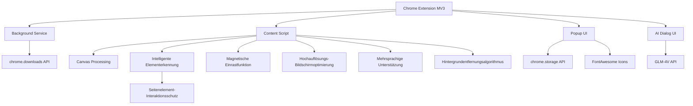

# Präziser Screenshot - Das erste intelligente Screenshot-Tool im KI-Zeitalter

[English](README_EN.md) | [简体中文](README.md) | [繁體中文](README_ZH_TW.md) | [日本語](README_JA.md) | [한국어](README_KO.md) | [Français](README_FR.md) | Deutsch

## Projektübersicht
"Präziser Screenshot" ist eine Chrome-Browser-Erweiterung, die entwickelt wurde, um das Problem des häufigen Anpassens der Seitenverhältnisse beim Erstellen von Screenshots zu lösen. Diese Erweiterung ermöglicht es Benutzern, Screenshot-Verhältnisse vorzudefinieren und dann kontinuierliche Aufnahmen zu machen, wobei das ausgewählte Verhältnis für jeden Screenshot automatisch beibehalten wird, was die Effizienz erheblich steigert. Die Erweiterung bietet eine schöne Benutzeroberfläche und einfache Bedienung, die für alle Arten von Benutzern geeignet ist.


## Schnellstart

### 1. Installation
- **Installation aus dem Chrome Web Store**
  - Besuchen Sie [Chrome Web Store - Präziser Screenshot](https://chromewebstore.google.com/detail/%E7%B2%BE%E5%87%86%E6%88%AA%E5%9B%BE-%E4%B8%80%E9%94%AE%E6%99%BA%E8%83%BD%E7%B2%BE%E5%87%86%E6%88%AA%E5%9B%BE%E5%B7%A5%E5%85%B7/mebflgmmheidlmggndpkkodonedongin?authuser=0&hl=zh-CN)
  - Klicken Sie auf "Zu Chrome hinzufügen", um die Installation abzuschließen

- **Installation im Entwicklermodus**
  - Laden Sie den Projektcode herunter und entpacken Sie ihn
  - Öffnen Sie den Chrome-Browser und besuchen Sie `chrome://extensions/`
  - Aktivieren Sie den "Entwicklermodus" in der oberen rechten Ecke
  - Klicken Sie auf "Entpackte Erweiterung laden" und wählen Sie den entpackten Ordner aus

### 2. Grundlegende Verwendung
1. **Screenshot starten**
   - Klicken Sie auf das Symbol "Präziser Screenshot" in der Browser-Symbolleiste
   - Oder verwenden Sie die Tastenkombination `Strg+Umschalt+S`

2. **Screenshot-Modus auswählen**
   - Normaler Modus: Wählen Sie voreingestellte Verhältnisse (1:1, 16:9 usw.)
   - Intelligenter Modus: Automatische Erkennung von Webelement-Grenzen

3. **Screenshot-Operationen**
   - Klicken und ziehen Sie, um einen Bereich auszuwählen
   - Größe anpassen: Ziehen Sie an den Rändern oder Ecken der Anpassungspunkte
   - Position verschieben: Ziehen Sie den mittleren Bereich der Auswahl
   - Screenshot bestätigen: Klicken Sie auf die Schaltfläche "Speichern" in der Symbolleiste oder drücken Sie die Eingabetaste
   - Screenshot abbrechen: Drücken Sie die Esc-Taste

### 3. Erweiterte Funktionen
- **Magnetisches Einrasten**: Rastet automatisch an Elementrändern ein, wenn sie sich in der Nähe befinden, für präzise Auswahl
- **Größensperre**: Batchweise Aufnahme von Bildern gleicher Größe
- **QR-Code-Scannen**: Erkennt und kopiert QR-Code-Inhalte
- **KI-Konversation**: Führt intelligente Gespräche mit dem Screenshot-Inhalt
- **Hintergrundentfernung**: Entfernt Bildhintergrund mit einem Klick
- **Schnelles Teilen**: Teilt Screenshots sofort in sozialen Medien
- **Schnelles Feedback**: Bietet Feedback zur Produktnutzung

### 4. Tastenkombinationen
- `Strg+Umschalt+S`: Screenshot starten
- `Enter`: Screenshot bestätigen
- `Esc`: Screenshot abbrechen
- `Strg+C`: Screenshot in die Zwischenablage kopieren

## Zielbenutzer
- Designer: Benötigen Material mit spezifischen Verhältnissen
- Content-Ersteller: Müssen Bilder mit festen Verhältnissen für verschiedene Plattformen vorbereiten
- E-Commerce-Verkäufer: Müssen Produktbilder mit einheitlichen Spezifikationen erstellen
- Social-Media-Betreiber: Müssen Bilder vorbereiten, die den Spezifikationen verschiedener Plattformen entsprechen

## Kernfunktionen
### 1. Verhältniseinstellungen
- ✅ Voreingestellte Verhältnisse, nach Gruppen organisiert:
  - Gängige Verhältnisse: 16:9 (Video/Bildschirm), 4:3 (Traditioneller Bildschirm), 1:1 (Quadrat/Instagram)
  - Mobile Geräte: 9:16 (Mobil Hochformat/Story), 3:4 (Xiaohongshu/iPad)
  - Soziale Medien: 2:1 (Xiaohongshu/Twitter Querformat), 1:2 (Pinterest), 4:5 (Instagram Hochformat), 3:2 (SNS-Cover)
  - Andere: 21:9 (Ultrawide), Freies Verhältnis
- ✅ Unterstützung für benutzerdefinierte Verhältniseingabe
- ✅ Speicherung der zuletzt verwendeten Verhältniseinstellungen
- ✅ Unterstützung für freien Verhältnismodus

### 2. Screenshot-Operationen
- ✅ Eintritt in den Screenshot-Modus nach Auswahl des Verhältnisses
- ✅ Screenshot-Bereich behält automatisch das ausgewählte Verhältnis bei
- ✅ Unterstützung für das Ziehen zum Anpassen der Größe des Screenshot-Bereichs (bei Beibehaltung des Verhältnisses)
- ✅ Unterstützung für das Verschieben der Position des Screenshot-Bereichs
- ✅ Anzeige der aktuellen Größeninformationen des Screenshot-Bereichs
- ✅ Unterstützung für kontinuierliche Screenshots ohne Verlassen des Screenshot-Modus
- ✅ Intelligenter Elementprüfungsmodus, automatische Erkennung von Webelement-Grenzen
- ✅ Unterstützung für Größensperre für einfache Batchaufnahme von Bildern gleicher Größe
- ✅ Unterstützung für QR-Code-Analyse, Ein-Klick-Erkennung und Link-Kopieren

### 3. Intelligente Erkennungsfunktionen
- ✅ Intelligente Erkennung von Seitenelement-Grenzen
- ✅ Automatische Hervorhebung der Elementgröße beim Überfahren
- ✅ Präzise Erfassung von UI-Komponenten mit einem Klick
- ✅ Unterstützung für Element-Mittellinie-Ausrichtung
- ✅ Intelligente Filterung unsichtbarer Elemente
- ✅ Verhinderung von Interaktionen mit Seitenelementen im intelligenten Screenshot-Modus zum Schutz des Screenshot-Status

### 4. Magnetische Einrastfunktionen
- ✅ Automatisches Einrasten an Seitenelement-Rändern
- ✅ Einstellbare Einraststärke
- ✅ Unterstützung für horizontales und vertikales Einrasten
- ✅ Intelligente Einrastschwellenwert-Steuerung
- ✅ Flüssige Übergangsanimationseffekte

### 5. Bildspeicherung
- ✅ Unterstützung für lokales Speichern von Screenshots
- ✅ Unterstützung für Kopieren in die Zwischenablage
- ✅ Unterstützung für Vorschau mehrerer kontinuierlich aufgenommener Bilder
- ✅ Anpassbares Bildformat (PNG/JPG) und Qualität
- ✅ Unterstützung für Hochauflösungs-Bildschirmoptimierung

### 6. QR-Code-Funktionen
- ✅ Ein-Klick-Analyse von QR-Codes in Screenshots
- ✅ Automatisches Kopieren von QR-Code-Links in die Zwischenablage
- ✅ Unterstützung für verschiedene gängige QR-Code-Formate
- ✅ Intelligente Erkennung und Lokalisierung der QR-Code-Position
- ✅ Klare Erfolgs-/Fehlerstatusbenachrichtigung

### 7. KI-Bildkonversation
- ✅ Ein-Klick-Aktivierung des KI-Konversationsmodus zur Interaktion mit dem Screenshot-Inhalt
- ✅ Bildverständnisfähigkeit basierend auf dem GLM-4V-Großmodell
- ✅ Unterstützung für Benutzerfragen und Mehrrundendialogsystem
- ✅ Abfrage von Bildinhalten, Texterklärung, Codeanalyse usw.
- ✅ Saubere und ansprechende Konversationsschnittstelle mit Markdown-Format-Unterstützung

### 8. Hintergrundentfernung
- ✅ Ein-Klick-Entfernung des Bildhintergrunds, Erzeugung von Bildern mit transparentem Hintergrund
- ✅ Eingebauter einfacher Hintergrundanalyse-Algorithmus
- ✅ Geeignet für einfache Hintergrundbilder wie Produkte und Objekte
- ✅ Direktes Kopieren in die Zwischenablage nach der Verarbeitung
- ✅ Erhaltung scharfer Kanten von Vordergrundobjekten

### 9. Benutzeroberfläche
- ✅ Einfaches und intuitives Schnittstellendesign mit Verlaufstitelbereich und eleganten Schatteneffekten
- ✅ Anzeige einer halbtransparenten Maske und eines hervorgehobenen Auswahlrahmens während des Screenshots
- ✅ Anzeige der aktuellen Verhältnis- und Größeninformationen
- ✅ Bereitstellung klarer Bedienungshinweise
- ✅ Unterstützung für mehrsprachige Schnittstelle
- ✅ Schnelle Teilen- und Feedback-Schaltflächen für einfache Benutzerinteraktion

### 10. Unterstützung für Tastenkombinationen
- ✅ Erweiterungsstartverknüpfung: Strg+Umschalt+S
- ✅ Screenshot-Operationstastenkombinationen (bestätigen, abbrechen)
- ✅ Unterstützung der ESC-Taste zum schnellen Abbrechen des Screenshots
- ✅ Unterstützung von Strg+C zum Kopieren des Screenshots in die Zwischenablage
- ✅ Unterstützung für kontinuierlichen Screenshot-Moduswechsel

## Technische Umsetzung
- Entwickelt mit Chrome-Erweiterung MV3-Architektur
- Verwendete Berechtigungen: activeTab, downloads, scripting, tabs, storage, clipboardWrite
- Verwendung von Canvas-Technologie zur Bildverarbeitung und Beibehaltung der Verhältnisse
- Verwendung der Chrome Storage API zum Speichern von Benutzereinstellungen
- Optimiert für verschiedene DPI-Bildschirme
- Intelligenter Elementerkennungsalgorithmus
- Magnetischer Einrastalgorithmus
- Flüssige Animationsübergangseffekte
- Einfache Implementierung des Hintergrundentfernungsalgorithmus
- Integration mit der GLM-4V-API für KI-Konversationsfunktionalität
- Intelligente Screenshot-Interaktionsschutzschicht: Verhindert versehentliche Interaktionen bei gleichzeitiger Beibehaltung der Elementerkennung im intelligenten Erkennungsmodus
- Verwendung der FontAwesome-Icon-Bibliothek für reichhaltige Schnittstellensymbole

## Projektstruktur
```
├── manifest.json       # Erweiterungsmanifestdatei
├── assets/            # Icons und Ressourcendateien
│   └── fontawesome/   # FontAwesome-Icon-Bibliothek
├── background/        # Hintergrunddienstskripte
├── content/           # Inhaltsskripte (Screenshot-Kernlogik)
├── popup/             # Popup-Fenster-Schnittstelle
├── utils/             # Hilfsfunktionen
│   └── i18n.js        # Internationalisierungsunterstützung
├── ai_dialog/         # KI-Dialogschnittstelle
└── _locales/          # Mehrsprachige Unterstützung
```

## Technische Architektur


## Tastenkombinationen
| Funktion | Tastenkombination |
|------|--------|
| Screenshot starten | Strg+Umschalt+S |
| Screenshot bestätigen | Enter |
| Screenshot abbrechen | Esc |
| Screenshot kopieren | Strg+C |
| Erweiterung öffnen | Auf das Symbolleistensymbol klicken |
| Kontinuierlichen Screenshot-Modus umschalten | Symbolleistenschaltfläche |
| Magnetisches Einrasten umschalten | Symbolleistenschaltfläche |
| Screenshot-Größe sperren | Symbolleistenschaltfläche |

## Open-Source-Lizenz
Dieses Projekt ist unter der [CC BY-NC-ND 4.0](https://creativecommons.org/licenses/by-nc-nd/4.0/)-Lizenz veröffentlicht.

### Lizenzschlüsselpunkte
- ✅ Zuordnung zum ursprünglichen Autor muss beibehalten werden
- ❌ Kommerzielle Nutzung nicht erlaubt
- ❌ Keine Änderung und Weiterverbreitung modifizierter Versionen
- 📝 Jede Nutzung erfordert die Genehmigung des Autors

### Nutzungsgenehmigung
Für die kommerzielle Nutzung dieses Projekts kontaktieren Sie bitte den Autor für eine Genehmigung. Jede nicht autorisierte kommerzielle Nutzung wird als Verletzung betrachtet.

Wenn Ihnen mein Inhalt gefällt und Sie mich ermutigen und unterstützen möchten, klicken Sie gerne auf [Buy Me a Coffee](https://buymeacoffee.com/zhushen), um mir einen Kaffee zu spendieren! 🎉☕

## Plan für Mehrwertfunktionen
Um die Benutzererfahrung weiter zu verbessern, plant "Präziser Screenshot" die schrittweise Einführung der folgenden Mehrwertfunktionen:

### Implementierte Funktionen
1. **Intelligente Hintergrundentfernung**
   - ✅ Automatische Erkennung und Entfernung einfarbiger Hintergründe
   - ✅ Erhaltung von Vordergrundinhalt, Erzeugung transparenter Ergebnisse
   - ✅ Geeignet für die Erstellung von Produktmaterialien und Designelementen
   
2. **KI-Bildkonversation**
   - ✅ Bildverständnisfähigkeit basierend auf GLM-4V
   - ✅ Unterstützung für Mehrrundendialogsystem und Inhaltsanalyse
   - ✅ Bildbezogene Fragen & Antworten und Inhaltserklärung

### Kurzfristig geplante Funktionen
3. **UI-Komponenten-Replikation**
   - Extraktion der Seitenstruktur aus Screenshots
   - Verbindung zu KI-Agent für UI-Komponenten-Replikation
   - Echtzeit-Durchsuchen des Replikationsprozesses

4. **Beliebte Copywriting-Imitation**
   - Extraktion von Textinhalt aus Screenshots
   - Verbindung zu KI-Agent für Copywriting-Imitation
   - Echtzeit-Durchsuchen des imitierten Inhalts

### Mittelfristig geplante Funktionen
5. **Bild-Superauflösung**
   - Verbesserung der Schärfe und Auflösung von Screenshots
   - Unterstützung für 2x-, 4x-Skala-Optionen
   - Geeignet für Szenarien, die hochwertige Bilder erfordern

6. **Bildübersetzung**
   - Erkennung und Übersetzung von Text in Bildern
   - Unterstützung für mehrsprachige Übersetzung
   - Beibehaltung des ursprünglichen Layouts und Stils

### Langfristig geplante Funktionen
7. **Fortgeschrittene intelligente Bildfreistellung**
   - Fortgeschrittene Hintergrundentfernung und Objektextraktion
   - Erhaltung komplexer Kantendetails
   - Ein-Klick-Erzeugung professioneller Freistellungseffekte

8. **Ein-Klick-Verschönerung**
   - Automatische Optimierung von Bildparametern
   - Intelligente Anpassung von Helligkeit, Kontrast, Sättigung
   - Geeignet für Social-Media-Sharing

### Mitgliedschaftsplanperspektive
In Zukunft planen wir, verschiedene Ebenen von Mitgliedschaftsservices einzuführen, um den Bedürfnissen verschiedener Benutzer gerecht zu werden:
- **Basisversion**: Beibehaltung aller vorhandenen Funktionen, auf ewig kostenlos
- **Erweiterte Version**: Enthält grundlegende Mehrwertfunktionen wie OCR und transparenten Hintergrund
- **Professionelle Version**: Enthält alle fortgeschrittenen Funktionen, geeignet für professionelle Ersteller

Wenn Sie besonders an einer bestimmten Funktion interessiert sind oder andere Funktionsvorschläge haben, geben Sie uns gerne Feedback über Issues!

## API-Schlüsselkonfiguration
Dieses Projekt verwendet die GLM-4V-API für Bildanalyse und KI-Konversationsfunktionalität. Um diese Funktion zu nutzen, müssen Sie den API-Schlüssel konfigurieren:

1. Kopieren Sie `config.example.js` nach `config.local.js`
2. Füllen Sie Ihren GLM-4V-API-Schlüssel in `config.local.js` ein
3. Stellen Sie sicher, dass `config.local.js` zu `.gitignore` hinzugefügt wurde (standardmäßig hinzugefügt)

Hinweis: Übermitteln Sie Ihren API-Schlüssel nicht an das GitHub-Repository. Wenn Sie versehentlich Ihren API-Schlüssel übermittelt haben, ändern Sie ihn bitte sofort.

## Stern-Verlauf
Wenn Sie es nützlich finden, geben Sie bitte einen Stern ⭐⭐⭐
[](https://www.star-history.com/#zhushen12580/short&Date) 