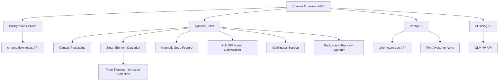

# Ratio Screenshot - The First Smart Screenshot Tool in the AI Era

English | [简体中文](README.md)

## Project Overview
"Ratio Screenshot" is a Chrome browser extension designed to solve the problem of frequently adjusting screenshot area ratios on web pages. This extension allows users to preset screenshot ratios and then perform continuous screenshot operations, automatically maintaining the selected ratio for each screenshot, greatly improving efficiency. The extension features a beautiful interface and simple operation, suitable for all types of users.


## Quick Start

### 1. Installation
- **Chrome Web Store Installation**
  - Visit [Chrome Web Store - Ratio Screenshot](https://chromewebstore.google.com/detail/%E7%B2%BE%E5%87%86%E6%88%AA%E5%9B%BE-%E4%B8%80%E9%94%AE%E6%99%BA%E8%83%BD%E7%B2%BE%E5%87%86%E6%88%AA%E5%9B%BE%E5%B7%A5%E5%85%B7/mebflgmmheidlmggndpkkodonedongin?authuser=0&hl=zh-CN)
  - Click "Add to Chrome" button to complete installation

- **Developer Mode Installation**
  - Download and extract the project code
  - Open Chrome browser, visit `chrome://extensions/`
  - Enable "Developer mode" in the top right corner
  - Click "Load unpacked" and select the extracted folder

### 2. Basic Usage
1. **Start Screenshot**
   - Click the Ratio Screenshot icon in the browser toolbar
   - Or use the shortcut key `Ctrl+Shift+S`

2. **Choose Screenshot Mode**
   - Normal mode: Select preset ratios (1:1, 16:9, etc.)
   - Smart mode: Automatically recognize web element boundaries

3. **Screenshot Operations**
   - Click and drag to select area
   - Adjust size: Drag borders or corner adjustment points
   - Move position: Drag the center area of the selection
   - Confirm screenshot: Click "Save" button in toolbar or press Enter
   - Cancel screenshot: Press Esc key

### 3. Advanced Features
- **Magnetic Snap**: Automatically snap to element edges when nearby, for precise selection
- **Lock Size**: Batch capture images of the same size
- **QR Code Scanning**: Recognize and copy QR code content
- **AI Conversation**: Engage in intelligent conversation with screenshot content
- **Background Removal**: Instantly remove image background
- **Quick Share**: Share screenshots to social media instantly
- **Quick Feedback**: Provide feedback on product usage

### 4. Shortcut Keys
- `Ctrl+Shift+S`: Start screenshot
- `Enter`: Confirm screenshot
- `Esc`: Cancel screenshot
- `Ctrl+C`: Copy screenshot to clipboard

## Target Users
- Designers: Need materials with specific ratios
- Content creators: Need to prepare fixed-ratio images for different platforms
- E-commerce sellers: Need to produce product images with consistent specifications
- Social media operators: Need to prepare images that meet the specifications of different platforms

## Core Features
### 1. Ratio Settings
- ✅ Preset common ratios, organized by groups:
  - Common ratios: 16:9 (Video/Screen), 4:3 (Traditional Screen), 1:1 (Square/Instagram)
  - Mobile devices: 9:16 (Mobile Portrait/Story), 3:4 (Xiaohongshu/iPad)
  - Social media: 2:1 (Xiaohongshu/Twitter Landscape), 1:2 (Pinterest), 4:5 (Instagram Portrait), 3:2 (SNS Cover)
  - Others: 21:9 (Ultrawide), Free ratio
- ✅ Support for custom ratio input
- ✅ Remember user's recently used ratio settings
- ✅ Support free ratio mode

### 2. Screenshot Operations
- ✅ Enter screenshot mode after selecting ratio
- ✅ Screenshot area automatically maintains selected ratio
- ✅ Support dragging to adjust screenshot area size (maintaining ratio)
- ✅ Support moving screenshot area position
- ✅ Display current screenshot area size information
- ✅ Support continuous screenshots without exiting screenshot mode
- ✅ Smart element inspection mode, automatically recognizing web element boundaries
- ✅ Support locking screenshot size for batch capturing of same-sized images
- ✅ Support QR code parsing, one-click recognition and link copying

### 3. Smart Detection Features
- ✅ Intelligent recognition of page element boundaries
- ✅ Automatic highlight of element dimensions on hover
- ✅ Precise capture of UI components with a click
- ✅ Support for element center-line alignment
- ✅ Intelligent filtering of invisible elements
- ✅ Prevention of interaction with page elements in smart screenshot mode to protect screenshot state

### 4. Magnetic Snap Features
- ✅ Automatically snap to page element edges
- ✅ Adjustable snap strength
- ✅ Support for horizontal and vertical snapping
- ✅ Intelligent snap threshold control
- ✅ Smooth transition animation effects

### 5. Image Saving
- ✅ Support saving screenshots locally
- ✅ Support copying to clipboard
- ✅ Support preview of continuously captured multiple images
- ✅ Customizable image format (PNG/JPG) and quality
- ✅ Support for high DPI screen optimization

### 6. QR Code Features
- ✅ One-click parsing of QR codes in screenshots
- ✅ Automatic copying of QR code links to clipboard
- ✅ Support for various common QR code formats
- ✅ Intelligent recognition and localization of QR code position
- ✅ Clear success/failure status notification

### 7. AI Image Conversation
- ✅ One-click activation of AI conversation mode to interact with screenshot content
- ✅ Image understanding capability based on GLM-4V large model
- ✅ Support for user questions and multi-turn dialogue
- ✅ Query image content, text explanation, code analysis, etc.
- ✅ Clean and attractive conversation interface with Markdown format support

### 8. Background Removal
- ✅ One-click removal of image background to generate transparent background image
- ✅ Built-in simple background analysis algorithm
- ✅ Suitable for simple background images like products and objects
- ✅ Direct copy to clipboard after processing
- ✅ Preserve clear edges of foreground objects

### 9. User Interface
- ✅ Clean and intuitive interface design with gradient title area and elegant shadow effects
- ✅ Semi-transparent mask and highlighted selection box during screenshot
- ✅ Display current ratio and size information
- ✅ Provide clear operation prompts
- ✅ Support multilingual interface
- ✅ Quick share and feedback buttons for easy user interaction

### 10. Shortcut Key Support
- ✅ Plugin launch shortcut: Ctrl+Shift+S
- ✅ Screenshot operation shortcuts (confirm, cancel)
- ✅ Support ESC key to quickly cancel screenshot
- ✅ Support Ctrl+C to copy screenshot to clipboard
- ✅ Support continuous screenshot mode switching

## Technical Implementation
- Developed using Chrome extension MV3 architecture
- Permissions used: activeTab, downloads, scripting, tabs, storage, clipboardWrite
- Use Canvas technology to process images and maintain ratios
- Use Chrome Storage API to store user settings
- Optimized for different DPI screens
- Smart element detection algorithm
- Magnetic snap algorithm
- Smooth animation transition effects
- Simple background removal algorithm implementation
- Integration with GLM-4V API for AI conversation functionality
- Smart screenshot interaction protection layer: prevent accidental interaction while maintaining element recognition in smart detection mode
- Use FontAwesome icon library for rich interface icons

## Project Structure
```
├── manifest.json       # Extension manifest file
├── assets/            # Icons and resource files
│   └── fontawesome/   # FontAwesome icon library
├── background/        # Background service scripts
├── content/           # Content scripts (screenshot core logic)
├── popup/             # Popup window interface
├── utils/             # Utility functions
│   └── i18n.js        # Internationalization support
├── ai_dialog/         # AI conversation interface
└── _locales/          # Multilingual support
```

## Technical Architecture


## Shortcut Keys
| Feature | Shortcut |
|------|--------|
| Start Screenshot | Ctrl+Shift+S |
| Confirm Screenshot | Enter |
| Cancel Screenshot | Esc |
| Copy Screenshot | Ctrl+C |
| Open Plugin | Click toolbar icon |
| Toggle Continuous Screenshot Mode | Toolbar button |
| Toggle Magnetic Snap | Toolbar button |
| Lock Screenshot Size | Toolbar button |

## Open Source License
This project is licensed under [CC BY-NC-ND 4.0](https://creativecommons.org/licenses/by-nc-nd/4.0/).

### License Key Points
- ✅ Must retain original author attribution
- ❌ No commercial use allowed
- ❌ No modification and redistribution of modified versions
- 📝 Any use requires authorization from the author

### Usage Authorization
For commercial use of this project, please contact the author for authorization. Any unauthorized commercial use will be considered infringement.

If you like my content and want to give some encouragement and support, feel free to click [Buy Me a Coffee](https://buymeacoffee.com/zhushen)! 🎉☕

## Value-added Feature Plan
To further enhance user experience, "Ratio Screenshot" plans to gradually introduce the following value-added features:

### Implemented Features
1. **Smart Background Removal**
   - ✅ Automatically recognize and remove single-color backgrounds
   - ✅ Preserve foreground content, generate transparent results
   - ✅ Suitable for creating product materials and design elements
   
2. **AI Image Conversation**
   - ✅ Image understanding based on GLM-4V
   - ✅ Support multi-turn dialogue and content analysis
   - ✅ Image-related Q&A and content explanation

### Near-term Planned Features
3. **UI Component Replication**
   - Extract page structure from screenshots
   - Connect to AI Agent for UI component replication
   - Browse replication process in real-time

4. **Popular Copywriting Imitation**
   - Extract text content from screenshots
   - Connect to AI Agent for copywriting imitation
   - Browse imitated content in real-time

### Mid-term Planned Features
5. **Image Super-resolution**
   - Enhance screenshot clarity and resolution
   - Support 2x, 4x scale options
   - Suitable for scenarios requiring high-quality images

6. **Image Translation**
   - Recognize and translate text in images
   - Support multilingual translation
   - Maintain original layout and style

### Long-term Planned Features
7. **Advanced Smart Image Matting**
   - Advanced background removal and object extraction
   - Preserve complex edge details
   - One-click generation of professional matting effects

8. **One-click Beautification**
   - Automatically optimize image parameters
   - Intelligently adjust brightness, contrast, saturation
   - Suitable for social media sharing

### Membership Plan Outlook
In the future, we plan to launch different levels of membership services to meet the needs of different users:
- **Basic Version**: Retain all existing features, free forever
- **Enhanced Version**: Include basic value-added features such as OCR and transparent background
- **Professional Version**: Include all advanced features, suitable for professional creators

If you are particularly interested in a certain feature or have other feature suggestions, welcome to provide feedback through issues!

## API Key Configuration
This project uses the GLM-4V API for image analysis and AI conversation functionality. To use this feature, you need to configure the API key:

1. Copy `config.example.js` to `config.local.js`
2. Fill in your GLM-4V API key in `config.local.js`
3. Ensure `config.local.js` is added to `.gitignore` (added by default)

Note: Do not commit your API key to the GitHub repository. If you accidentally commit your API key, please change it immediately.

## Star History
If you find it useful, please give it a star ⭐⭐⭐
[](https://www.star-history.com/#zhushen12580/short&Date) 