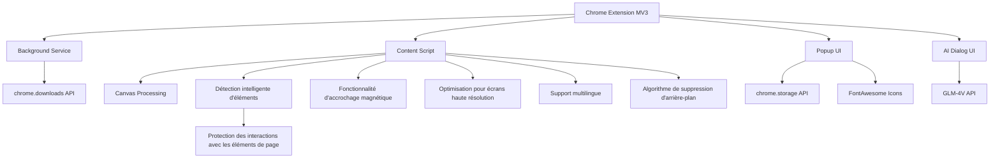

# Capture d'écran précise - Le premier outil de capture d'écran intelligent de l'ère IA

[English](README_EN.md) | [简体中文](README.md) | [繁體中文](README_ZH_TW.md) | [日本語](README_JA.md) | [한국어](README_KO.md) | Français

## Aperçu du projet
"Capture d'écran précise" est une extension Chrome conçue pour résoudre le problème de l'ajustement fréquent des proportions des zones de capture d'écran sur les pages web. Cette extension permet aux utilisateurs de prédéfinir les proportions de capture d'écran, puis d'effectuer des captures continues, en maintenant automatiquement les proportions sélectionnées pour chaque capture, améliorant ainsi considérablement l'efficacité. L'extension présente une interface élégante et une utilisation simple, adaptée à tous types d'utilisateurs.


## Démarrage rapide

### 1. Installation
- **Installation depuis le Chrome Web Store**
  - Visitez [Chrome Web Store - Capture d'écran précise](https://chromewebstore.google.com/detail/%E7%B2%BE%E5%87%86%E6%88%AA%E5%9B%BE-%E4%B8%80%E9%94%AE%E6%99%BA%E8%83%BD%E7%B2%BE%E5%87%86%E6%88%AA%E5%9B%BE%E5%B7%A5%E5%85%B7/mebflgmmheidlmggndpkkodonedongin?authuser=0&hl=zh-CN)
  - Cliquez sur le bouton "Ajouter à Chrome" pour terminer l'installation

- **Installation en mode développeur**
  - Téléchargez et extrayez le code du projet
  - Ouvrez le navigateur Chrome, visitez `chrome://extensions/`
  - Activez le "Mode développeur" dans le coin supérieur droit
  - Cliquez sur "Charger l'extension non empaquetée" et sélectionnez le dossier extrait

### 2. Utilisation de base
1. **Lancer la capture d'écran**
   - Cliquez sur l'icône Capture d'écran précise dans la barre d'outils du navigateur
   - Ou utilisez le raccourci `Ctrl+Shift+S`

2. **Choisir le mode de capture d'écran**
   - Mode normal : sélectionnez des proportions prédéfinies (1:1, 16:9, etc.)
   - Mode intelligent : reconnaissance automatique des limites des éléments web

3. **Opérations de capture d'écran**
   - Cliquez et faites glisser pour sélectionner une zone
   - Ajuster la taille : faites glisser les bordures ou les points d'ajustement dans les coins
   - Déplacer la position : faites glisser la zone centrale de la sélection
   - Confirmer la capture d'écran : cliquez sur le bouton "Enregistrer" dans la barre d'outils ou appuyez sur Enter
   - Annuler la capture d'écran : appuyez sur la touche Esc

### 3. Fonctionnalités avancées
- **Accrochage magnétique** : s'accroche automatiquement aux bords des éléments lors de la proximité, pour une sélection précise
- **Verrouillage de taille** : capture par lots d'images de même taille
- **Analyse de code QR** : reconnaît et copie le contenu des codes QR
- **Conversation IA** : engage une conversation intelligente avec le contenu de la capture d'écran
- **Suppression d'arrière-plan** : supprime instantanément l'arrière-plan de l'image
- **Partage rapide** : partage instantanément les captures d'écran sur les réseaux sociaux
- **Retour rapide** : fournit des commentaires sur l'utilisation du produit

### 4. Raccourcis clavier
- `Ctrl+Shift+S` : lancer la capture d'écran
- `Enter` : confirmer la capture d'écran
- `Esc` : annuler la capture d'écran
- `Ctrl+C` : copier la capture d'écran dans le presse-papiers

## Utilisateurs cibles
- Designers : besoin de matériaux avec des proportions spécifiques
- Créateurs de contenu : besoin de préparer des images à proportions fixes pour différentes plateformes
- Vendeurs e-commerce : besoin de produire des images de produits aux spécifications uniformes
- Opérateurs de médias sociaux : besoin de préparer des images conformes aux spécifications des différentes plateformes

## Fonctionnalités principales
### 1. Réglage des proportions
- ✅ Proportions prédéfinies organisées par groupes :
  - Proportions courantes : 16:9 (Vidéo/Écran), 4:3 (Écran traditionnel), 1:1 (Carré/Instagram)
  - Appareils mobiles : 9:16 (Mobile portrait/Story), 3:4 (Xiaohongshu/iPad)
  - Médias sociaux : 2:1 (Xiaohongshu/Twitter paysage), 1:2 (Pinterest), 4:5 (Instagram portrait), 3:2 (Couverture SNS)
  - Autres : 21:9 (Ultra-large), Proportions libres
- ✅ Prise en charge de la saisie de proportions personnalisées
- ✅ Mémorisation des derniers réglages de proportions utilisés
- ✅ Prise en charge du mode proportions libres

### 2. Opérations de capture d'écran
- ✅ Entrée en mode capture d'écran après sélection des proportions
- ✅ La zone de capture d'écran maintient automatiquement les proportions sélectionnées
- ✅ Prise en charge du glissement pour ajuster la taille de la zone de capture (en maintenant les proportions)
- ✅ Prise en charge du déplacement de la position de la zone de capture
- ✅ Affichage des informations de taille de la zone de capture actuelle
- ✅ Prise en charge des captures d'écran continues sans quitter le mode capture
- ✅ Mode d'inspection d'éléments intelligent, reconnaissance automatique des limites d'éléments web
- ✅ Prise en charge du verrouillage de taille pour la capture par lots d'images de même taille
- ✅ Prise en charge de l'analyse de code QR, reconnaissance en un clic et copie de lien

### 3. Fonctionnalités de détection intelligente
- ✅ Reconnaissance intelligente des limites des éléments de page
- ✅ Mise en évidence automatique des dimensions des éléments au survol
- ✅ Capture précise des composants UI d'un simple clic
- ✅ Prise en charge de l'alignement sur la ligne centrale des éléments
- ✅ Filtrage intelligent des éléments invisibles
- ✅ Prévention des interactions avec les éléments de page en mode capture intelligente pour protéger l'état de la capture

### 4. Fonctionnalités d'accrochage magnétique
- ✅ Accrochage automatique aux bords des éléments de page
- ✅ Force d'accrochage réglable
- ✅ Prise en charge de l'accrochage horizontal et vertical
- ✅ Contrôle intelligent du seuil d'accrochage
- ✅ Effets d'animation de transition fluides

### 5. Enregistrement d'images
- ✅ Prise en charge de l'enregistrement local des captures d'écran
- ✅ Prise en charge de la copie dans le presse-papiers
- ✅ Prise en charge de la prévisualisation de plusieurs images capturées en continu
- ✅ Format d'image personnalisable (PNG/JPG) et qualité
- ✅ Prise en charge de l'optimisation pour écrans haute résolution

### 6. Fonctionnalités de code QR
- ✅ Analyse en un clic des codes QR dans les captures d'écran
- ✅ Copie automatique des liens de code QR dans le presse-papiers
- ✅ Prise en charge de divers formats courants de codes QR
- ✅ Reconnaissance et localisation intelligentes de la position des codes QR
- ✅ Notification claire de l'état de réussite/échec

### 7. Conversation IA sur image
- ✅ Activation en un clic du mode conversation IA pour interagir avec le contenu de la capture d'écran
- ✅ Capacité de compréhension d'image basée sur le grand modèle GLM-4V
- ✅ Prise en charge des questions utilisateur et du dialogue multi-tours
- ✅ Interrogation sur le contenu de l'image, explication de texte, analyse de code, etc.
- ✅ Interface de conversation propre et attrayante avec prise en charge du format Markdown

### 8. Suppression d'arrière-plan
- ✅ Suppression en un clic de l'arrière-plan de l'image, génération d'image à arrière-plan transparent
- ✅ Algorithme simple d'analyse d'arrière-plan intégré
- ✅ Adapté aux images à arrière-plan simple comme les produits et objets
- ✅ Copie directe dans le presse-papiers après traitement
- ✅ Préservation des contours nets des objets au premier plan

### 9. Interface utilisateur
- ✅ Design d'interface simple et intuitif, avec zone de titre en dégradé et effets d'ombre élégants
- ✅ Affichage de masque semi-transparent et de cadre de sélection en surbrillance pendant la capture
- ✅ Affichage des informations de proportions et de taille actuelles
- ✅ Fourniture d'instructions d'opération claires
- ✅ Prise en charge de l'interface multilingue
- ✅ Boutons de partage rapide et de retour pour une interaction utilisateur facile

### 10. Prise en charge des raccourcis clavier
- ✅ Raccourci de lancement de l'extension : Ctrl+Shift+S
- ✅ Raccourcis d'opération de capture d'écran (confirmer, annuler)
- ✅ Prise en charge de la touche ESC pour annuler rapidement la capture d'écran
- ✅ Prise en charge de Ctrl+C pour copier la capture d'écran dans le presse-papiers
- ✅ Prise en charge du basculement de mode de capture continue

## Implémentation technique
- Développé avec l'architecture Chrome extension MV3
- Permissions utilisées : activeTab, downloads, scripting, tabs, storage, clipboardWrite
- Utilisation de la technologie Canvas pour traiter les images et maintenir les proportions
- Utilisation de l'API Chrome Storage pour stocker les paramètres utilisateur
- Optimisé pour différents écrans DPI
- Algorithme de détection intelligente d'éléments
- Algorithme d'accrochage magnétique
- Effets de transition d'animation fluides
- Implémentation simple d'algorithme de suppression d'arrière-plan
- Intégration avec l'API GLM-4V pour la fonctionnalité de conversation IA
- Couche de protection des interactions de capture intelligente : prévention des interactions accidentelles tout en maintenant la reconnaissance d'éléments en mode détection intelligente
- Utilisation de la bibliothèque d'icônes FontAwesome pour des icônes d'interface riches

## Structure du projet
```
├── manifest.json       # Fichier manifeste de l'extension
├── assets/            # Icônes et fichiers de ressources
│   └── fontawesome/   # Bibliothèque d'icônes FontAwesome
├── background/        # Scripts de service en arrière-plan
├── content/           # Scripts de contenu (logique principale de capture d'écran)
├── popup/             # Interface de fenêtre popup
├── utils/             # Fonctions utilitaires
│   └── i18n.js        # Support d'internationalisation
├── ai_dialog/         # Interface de dialogue IA
└── _locales/          # Support multilingue
```

## Architecture technique


## Raccourcis clavier
| Fonctionnalité | Raccourci |
|------|--------|
| Lancer la capture d'écran | Ctrl+Shift+S |
| Confirmer la capture d'écran | Enter |
| Annuler la capture d'écran | Esc |
| Copier la capture d'écran | Ctrl+C |
| Ouvrir l'extension | Cliquer sur l'icône de la barre d'outils |
| Basculer le mode de capture continue | Bouton de la barre d'outils |
| Basculer l'accrochage magnétique | Bouton de la barre d'outils |
| Verrouiller la taille de la capture d'écran | Bouton de la barre d'outils |

## Licence open source
Ce projet est publié sous la licence [CC BY-NC-ND 4.0](https://creativecommons.org/licenses/by-nc-nd/4.0/).

### Points clés de la licence
- ✅ L'attribution de l'auteur original doit être maintenue
- ❌ Utilisation commerciale interdite
- ❌ Modification et redistribution des versions modifiées interdites
- 📝 Toute utilisation nécessite l'autorisation de l'auteur

### Autorisation d'utilisation
Pour une utilisation commerciale de ce projet, veuillez contacter l'auteur pour obtenir une autorisation. Toute utilisation commerciale non autorisée sera considérée comme une violation.

Si vous aimez mon contenu et souhaitez m'encourager et me soutenir, n'hésitez pas à cliquer sur [Buy Me a Coffee](https://buymeacoffee.com/zhushen) pour m'offrir un café ! 🎉☕

## Plan des fonctionnalités à valeur ajoutée
Pour améliorer davantage l'expérience utilisateur, "Capture d'écran précise" prévoit d'introduire progressivement les fonctionnalités à valeur ajoutée suivantes :

### Fonctionnalités implémentées
1. **Suppression intelligente d'arrière-plan**
   - ✅ Reconnaissance et suppression automatiques des arrière-plans unicolores
   - ✅ Conservation du contenu au premier plan, génération de résultats transparents
   - ✅ Adapté à la création de matériaux de produits et d'éléments de design
   
2. **Conversation IA sur image**
   - ✅ Capacité de compréhension d'image basée sur GLM-4V
   - ✅ Prise en charge du dialogue multi-tours et de l'analyse de contenu
   - ✅ Q&R liées à l'image et explication de contenu

### Fonctionnalités prévues à court terme
3. **Réplication de composants UI**
   - Extraction de la structure de page à partir des captures d'écran
   - Connexion à l'IA Agent pour la réplication de composants UI
   - Navigation en temps réel dans le processus de réplication

4. **Imitation de rédaction populaire**
   - Extraction de contenu textuel à partir des captures d'écran
   - Connexion à l'IA Agent pour l'imitation de rédaction
   - Navigation en temps réel dans le contenu imité

### Fonctionnalités prévues à moyen terme
5. **Super-résolution d'image**
   - Amélioration de la netteté et de la résolution des captures d'écran
   - Prise en charge des options d'échelle 2x, 4x
   - Adapté aux scénarios nécessitant des images de haute qualité

6. **Traduction d'image**
   - Reconnaissance et traduction du texte dans les images
   - Prise en charge de la traduction multilingue
   - Conservation de la mise en page et du style d'origine

### Fonctionnalités prévues à long terme
7. **Détourage intelligent avancé**
   - Suppression avancée d'arrière-plan et extraction d'objets
   - Conservation des détails complexes des contours
   - Génération d'effets de détourage professionnels en un clic

8. **Embellissement en un clic**
   - Optimisation automatique des paramètres d'image
   - Ajustement intelligent de la luminosité, du contraste, de la saturation
   - Adapté au partage sur les réseaux sociaux

### Perspective de plan d'adhésion
À l'avenir, nous prévoyons de lancer différents niveaux de services d'adhésion pour répondre aux besoins de différents utilisateurs :
- **Version de base** : conservation de toutes les fonctionnalités existantes, gratuite à vie
- **Version améliorée** : inclusion des fonctionnalités de base à valeur ajoutée comme l'OCR et l'arrière-plan transparent
- **Version professionnelle** : inclusion de toutes les fonctionnalités avancées, adaptée aux créateurs professionnels

Si vous êtes particulièrement intéressé par une fonctionnalité spécifique ou avez d'autres suggestions de fonctionnalités, n'hésitez pas à nous faire part de vos commentaires via les issues !

## Configuration de la clé API
Ce projet utilise l'API GLM-4V pour l'analyse d'image et la fonctionnalité de conversation IA. Pour utiliser cette fonctionnalité, vous devez configurer la clé API :

1. Copiez `config.example.js` en `config.local.js`
2. Remplissez votre clé API GLM-4V dans `config.local.js`
3. Assurez-vous que `config.local.js` est ajouté à `.gitignore` (ajouté par défaut)

Note : Ne soumettez pas votre clé API au dépôt GitHub. Si vous soumettez accidentellement votre clé API, veuillez la changer immédiatement.

## Historique des étoiles
Si vous trouvez cela utile, n'hésitez pas à mettre une étoile ⭐⭐⭐
[](https://www.star-history.com/#zhushen12580/short&Date) 