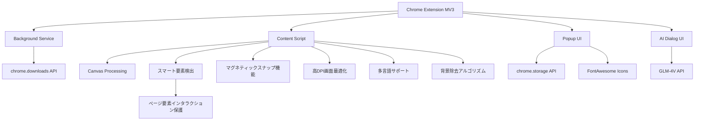

# 精密スクリーンショット - AI時代最初のスマートスクリーンショットツール

[English](README_EN.md) | [简体中文](README.md) | [繁體中文](README_ZH_TW.md) | 日本語

## プロジェクト概要
「精密スクリーンショット」は、ウェブページのスクリーンショット撮影時に画面比率の調整が頻繁に必要になる問題を解決するためのChrome拡張機能です。この拡張機能を使用すると、スクリーンショットの比率をあらかじめ設定し、連続撮影ができるため、毎回選択した比率が自動的に維持され、効率が大幅に向上します。美しいインターフェースと簡単な操作性を備え、あらゆるユーザーに適しています。


## クイックスタート

### 1. インストール
- **Chrome ウェブストアからインストール**
  - [Chrome ウェブストア - 精密スクリーンショット](https://chromewebstore.google.com/detail/%E7%B2%BE%E5%87%86%E6%88%AA%E5%9B%BE-%E4%B8%80%E9%94%AE%E6%99%BA%E8%83%BD%E7%B2%BE%E5%87%86%E6%88%AA%E5%9B%BE%E5%B7%A5%E5%85%B7/mebflgmmheidlmggndpkkodonedongin?authuser=0&hl=zh-CN)にアクセス
  - 「Chromeに追加」ボタンをクリックしてインストールを完了

- **開発者モードでインストール**
  - プロジェクトコードをダウンロードして解凍
  - Chromeブラウザを開き、`chrome://extensions/`にアクセス
  - 右上の「デベロッパーモード」をオン
  - 「パッケージ化されていない拡張機能を読み込む」をクリックし、解凍したフォルダを選択

### 2. 基本的な使い方
1. **スクリーンショットを開始**
   - ブラウザツールバーの精密スクリーンショットアイコンをクリック
   - またはショートカットキー `Ctrl+Shift+S` を使用

2. **スクリーンショットモードを選択**
   - 通常モード：プリセット比率（1:1、16:9など）を選択
   - スマートモード：ウェブ要素の境界を自動認識

3. **スクリーンショット操作**
   - クリックしてドラッグで領域を選択
   - サイズ調整：枠線や角の調整ポイントをドラッグ
   - 位置移動：選択領域の中央部分をドラッグ
   - スクリーンショット確認：ツールバーの「保存」ボタンをクリックまたはEnterキーを押す
   - スクリーンショットキャンセル：Escキーを押す

### 3. 高度な機能
- **マグネティックスナップ**：要素の端に近づくと自動的にスナップし、正確な選択が可能
- **サイズロック**：同じサイズの画像をバッチで撮影
- **QRコード解析**：QRコードの内容を認識してコピー
- **AI会話**：スクリーンショットの内容とインテリジェントな会話を行う
- **背景除去**：ワンクリックで画像の背景を削除
- **クイック共有**：スクリーンショットをソーシャルメディアにすぐに共有
- **クイックフィードバック**：製品使用に関するフィードバックを提供

### 4. ショートカットキー
- `Ctrl+Shift+S`：スクリーンショット開始
- `Enter`：スクリーンショット確認
- `Esc`：スクリーンショットキャンセル
- `Ctrl+C`：スクリーンショットをクリップボードにコピー

## ターゲットユーザー
- デザイナー：特定の比率の素材が必要
- コンテンツクリエイター：異なるプラットフォーム用に固定比率の画像を準備する必要がある
- ECサイト販売者：統一された仕様の製品画像を作成する必要がある
- ソーシャルメディア運営者：異なるプラットフォームの仕様に合った画像を準備する必要がある

## 主要機能
### 1. 比率設定
- ✅ プリセット比率をグループ別に整理：
  - 一般的な比率：16:9（ビデオ/画面）、4:3（従来の画面）、1:1（正方形/Instagram）
  - モバイルデバイス：9:16（スマホ縦向き/ストーリー）、3:4（Xiaohongshu/iPad）
  - ソーシャルメディア：2:1（Xiaohongshu/Twitter横向き）、1:2（Pinterest）、4:5（Instagram縦向き）、3:2（SNSカバー）
  - その他：21:9（ウルトラワイド）、自由比率
- ✅ カスタム比率入力をサポート
- ✅ 最近使用した比率設定を記憶
- ✅ 自由比率モードをサポート

### 2. スクリーンショット操作
- ✅ 比率選択後にスクリーンショットモードに入る
- ✅ スクリーンショット領域が選択した比率を自動的に維持
- ✅ ドラッグでスクリーンショット領域のサイズを調整（比率を維持）
- ✅ スクリーンショット領域の位置移動をサポート
- ✅ 現在のスクリーンショット領域のサイズ情報を表示
- ✅ 連続スクリーンショットをサポート、モードを終了せずに複数の画像を撮影可能
- ✅ スマート要素検査モード、ウェブ要素の境界を自動認識
- ✅ スクリーンショットサイズのロックをサポート、同じサイズの画像をバッチで簡単に撮影
- ✅ QRコード解析をサポート、ワンクリックで認識してリンクをコピー

### 3. スマート検出機能
- ✅ ページ要素の境界をインテリジェントに認識
- ✅ ホバー時に要素のサイズを自動的にハイライト表示
- ✅ クリックするだけでUIコンポーネントを正確にキャプチャ
- ✅ 要素の中心線の整列をサポート
- ✅ 非表示要素をインテリジェントにフィルタリング
- ✅ スマートスクリーンショットモードでページ要素との相互作用を防止し、スクリーンショット状態を保護

### 4. マグネティックスナップ機能
- ✅ ページ要素の端に自動的にスナップ
- ✅ スナップ強度の調整が可能
- ✅ 水平および垂直方向のスナップをサポート
- ✅ インテリジェントなスナップしきい値制御
- ✅ スムーズな遷移アニメーション効果

### 5. 画像保存
- ✅ スクリーンショットをローカルに保存するサポート
- ✅ クリップボードへのコピーをサポート
- ✅ 連続撮影した複数の画像のプレビューをサポート
- ✅ 画像形式（PNG/JPG）と品質のカスタマイズが可能
- ✅ 高DPI画面の最適化をサポート

### 6. QRコード機能
- ✅ スクリーンショット内のQRコードをワンクリックで解析
- ✅ QRコードリンクを自動的にクリップボードにコピー
- ✅ さまざまな一般的なQRコード形式をサポート
- ✅ QRコード位置のインテリジェントな認識と位置特定
- ✅ 明確な成功/失敗ステータス通知

### 7. AI画像会話
- ✅ ワンクリックでAI会話モードを起動し、スクリーンショットの内容と会話
- ✅ GLM-4V大規模モデルに基づく画像理解能力
- ✅ ユーザーの質問と複数ターンの対話をサポート
- ✅ 画像内容、テキスト説明、コード分析などの問い合わせが可能
- ✅ シンプルで美しい会話インターフェース、Markdown形式の表示をサポート

### 8. 背景除去
- ✅ ワンクリックで画像の背景を削除し、透明な背景画像を生成
- ✅ シンプルな背景分析アルゴリズムを内蔵
- ✅ 製品、オブジェクトなどのシンプルな背景画像に適用
- ✅ 処理完了後に直接クリップボードにコピー
- ✅ 前景オブジェクトの鮮明なエッジを保持

### 9. ユーザーインターフェース
- ✅ シンプルで直感的なインターフェースデザイン、グラデーションタイトル領域とエレガントなシャドウ効果を備える
- ✅ スクリーンショット時に半透明マスクとハイライト選択ボックスを表示
- ✅ 現在の比率とサイズ情報を表示
- ✅ 明確な操作プロンプトを提供
- ✅ 多言語インターフェースをサポート
- ✅ クイック共有とフィードバックボタンで簡単なユーザーインタラクション

### 10. ショートカットキーサポート
- ✅ プラグイン起動ショートカット：Ctrl+Shift+S
- ✅ スクリーンショット操作のショートカット（確認、キャンセル）
- ✅ ESCキーで素早くスクリーンショットをキャンセル
- ✅ Ctrl+Cでスクリーンショットをクリップボードにコピー
- ✅ 連続スクリーンショットモード切り替えをサポート

## 技術実装
- Chrome拡張MV3アーキテクチャを使用して開発
- 使用権限：activeTab, downloads, scripting, tabs, storage, clipboardWrite
- Canvas技術を使用して画像を処理し比率を維持
- Chrome Storage APIを使用してユーザー設定を保存
- 異なるDPI画面に対して最適化
- スマート要素検出アルゴリズム
- マグネティックスナップアルゴリズム
- スムーズなアニメーション遷移効果
- シンプルな背景除去アルゴリズムの実装
- GLM-4V APIとの統合によるAI会話機能の実現
- スマートスクリーンショットインタラクション保護層：スマート検出モードで要素認識を維持しながら誤操作を防止
- FontAwesomeアイコンライブラリを採用して豊富なインターフェースアイコンを提供

## プロジェクト構造
```
├── manifest.json       # 拡張マニフェストファイル
├── assets/            # アイコンとリソースファイル
│   └── fontawesome/   # FontAwesomeアイコンライブラリ
├── background/        # バックグラウンドサービススクリプト
├── content/           # コンテンツスクリプト（スクリーンショットコアロジック）
├── popup/             # ポップアップウィンドウインターフェース
├── utils/             # ユーティリティ関数
│   └── i18n.js        # 国際化サポート
├── ai_dialog/         # AI会話インターフェース
└── _locales/          # 多言語サポート
```

## 技術アーキテクチャ


## ショートカットキー
| 機能 | ショートカット |
|------|--------|
| スクリーンショット開始 | Ctrl+Shift+S |
| スクリーンショット確認 | Enter |
| スクリーンショットキャンセル | Esc |
| スクリーンショットコピー | Ctrl+C |
| プラグインを開く | ツールバーアイコンをクリック |
| 連続スクリーンショットモード切替 | ツールバーボタン |
| マグネティックスナップ切替 | ツールバーボタン |
| スクリーンショットサイズロック | ツールバーボタン |

## オープンソースライセンス
このプロジェクトは [CC BY-NC-ND 4.0](https://creativecommons.org/licenses/by-nc-nd/4.0/) ライセンスの下で公開されています。

### ライセンス要点
- ✅ 原作者の表示を維持する必要があります
- ❌ 商用利用は禁止されています
- ❌ 修正および修正版の再配布は禁止されています
- 📝 いかなる使用も作者の許可が必要です

### 使用許可
このプロジェクトを商用目的で使用する場合は、作者に許可を求めてください。無許可の商用利用は侵害とみなされます。

私のコンテンツが気に入って、励ましやサポートを提供したい場合は、[Buy Me a Coffee](https://buymeacoffee.com/zhushen) をクリックしてコーヒーをご馳走ください！🎉☕

## 付加価値機能計画
ユーザー体験をさらに向上させるために、「精密スクリーンショット」は以下の付加価値機能を段階的に導入する予定です：

### 実装済み機能
1. **スマート背景除去**
   - ✅ 単色背景を自動認識して削除
   - ✅ 前景コンテンツを保持し、透明な結果を生成
   - ✅ 製品素材やデザイン要素の作成に適しています
   
2. **AI画像会話**
   - ✅ GLM-4Vベースの画像理解能力
   - ✅ 複数ターンの対話とコンテンツ分析をサポート
   - ✅ 画像関連のQ&Aとコンテンツ説明

### 近日予定の機能
3. **UIコンポーネントの複製**
   - スクリーンショットからページ構造を抽出
   - AI Agentを接続してUIコンポーネントを複製
   - リアルタイムで複製プロセスを閲覧

4. **人気コピーライティングの模倣**
   - スクリーンショットからテキストコンテンツを抽出
   - AI Agentを接続してコピーライティングを模倣
   - リアルタイムで模倣コンテンツを閲覧

### 中期予定の機能
5. **画像超解像度**
   - スクリーンショットの鮮明さと解像度を向上
   - 2x、4xスケールオプションをサポート
   - 高品質画像が必要なシナリオに適しています

6. **画像翻訳**
   - 画像内のテキストを認識して翻訳
   - 多言語翻訳をサポート
   - 元のレイアウトとスタイルを維持

### 長期予定の機能
7. **高度なスマート画像マッティング**
   - 高度な背景除去とオブジェクト抽出
   - 複雑なエッジの詳細を保持
   - ワンクリックでプロフェッショナルなマッティング効果を生成

8. **ワンクリック美化**
   - 画像パラメータを自動的に最適化
   - 明るさ、コントラスト、彩度をインテリジェントに調整
   - ソーシャルメディア共有に適しています

### メンバーシッププラン展望
将来、異なるユーザーのニーズを満たすために、異なるレベルのメンバーシップサービスを提供する予定です：
- **基本版**：既存のすべての機能を維持し、永久無料
- **強化版**：OCRや透明背景などの基本的な付加価値機能を含む
- **プロフェッショナル版**：すべての高度な機能を含み、プロフェッショナルなクリエイターに適しています

特定の機能に特に興味がある場合、または他の機能の提案がある場合は、issuesを通じてフィードバックをお寄せください！

## APIキー設定
このプロジェクトは画像分析とAI会話機能にGLM-4V APIを使用しています。この機能を使用するには、APIキーを設定する必要があります：

1. `config.example.js`を`config.local.js`にコピー
2. `config.local.js`にGLM-4V APIキーを入力
3. `config.local.js`が`.gitignore`に追加されていることを確認（デフォルトで追加済み）

注意：APIキーをGitHubリポジトリにコミットしないでください。誤ってAPIキーをコミットした場合は、すぐに変更してください。

## スター履歴
役立つと思ったら、スターをつけてください⭐⭐⭐
[](https://www.star-history.com/#zhushen12580/short&Date) 