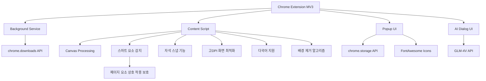

# 정밀 스크린샷 - AI 시대의 첫 번째 스마트 스크린샷 도구

[English](README_EN.md) | [简体中文](README.md) | [繁體中文](README_ZH_TW.md) | [日本語](README_JA.md) | 한국어

## 프로젝트 개요
"정밀 스크린샷"은 웹 페이지를 캡처할 때 스크린샷 영역 비율을 자주 조정해야 하는 문제를 해결하기 위한 Chrome 브라우저 확장 프로그램입니다. 이 확장 프로그램은 사용자가 스크린샷 비율을 미리 설정한 다음 연속 촬영을 할 수 있게 해주며, 매번 선택한 비율을 자동으로 유지하여 스크린샷 효율성을 크게 향상시킵니다. 아름다운 인터페이스와 간단한 조작으로 모든 유형의 사용자에게 적합합니다.


## 빠른 시작

### 1. 설치
- **Chrome 웹 스토어에서 설치**
  - [Chrome 웹 스토어 - 정밀 스크린샷](https://chromewebstore.google.com/detail/%E7%B2%BE%E5%87%86%E6%88%AA%E5%9B%BE-%E4%B8%80%E9%94%AE%E6%99%BA%E8%83%BD%E7%B2%BE%E5%87%86%E6%88%AA%E5%9B%BE%E5%B7%A5%E5%85%B7/mebflgmmheidlmggndpkkodonedongin?authuser=0&hl=zh-CN) 방문
  - "Chrome에 추가" 버튼을 클릭하여 설치 완료

- **개발자 모드로 설치**
  - 프로젝트 코드를 다운로드하고 압축 해제
  - Chrome 브라우저를 열고 `chrome://extensions/` 방문
  - 오른쪽 상단의 "개발자 모드" 활성화
  - "압축해제된 확장 프로그램 로드"를 클릭하고 압축 해제된 폴더 선택

### 2. 기본 사용법
1. **스크린샷 시작**
   - 브라우저 도구 모음에서 정밀 스크린샷 아이콘 클릭
   - 또는 단축키 `Ctrl+Shift+S` 사용

2. **스크린샷 모드 선택**
   - 일반 모드: 프리셋 비율(1:1, 16:9 등) 선택
   - 스마트 모드: 웹 요소 경계 자동 인식

3. **스크린샷 작업**
   - 클릭하고 드래그하여 영역 선택
   - 크기 조정: 테두리나 모서리 조정 포인트 드래그
   - 위치 이동: 선택 영역의 중앙 부분 드래그
   - 스크린샷 확인: 도구 모음의 "저장" 버튼을 클릭하거나 Enter 키 누름
   - 스크린샷 취소: Esc 키 누름

### 3. 고급 기능
- **자석 스냅**: 요소 가장자리에 근접할 때 자동으로 스냅되어 정확한 선택 가능
- **크기 잠금**: 동일한 크기의 이미지를 배치로 캡처
- **QR 코드 스캔**: QR 코드 내용을 인식하고 복사
- **AI 대화**: 스크린샷 내용과 지능적인 대화 진행
- **배경 제거**: 원클릭으로 이미지 배경 제거
- **빠른 공유**: 스크린샷을 소셜 미디어에 즉시 공유
- **빠른 피드백**: 제품 사용에 관한 피드백 제공

### 4. 단축키
- `Ctrl+Shift+S`: 스크린샷 시작
- `Enter`: 스크린샷 확인
- `Esc`: 스크린샷 취소
- `Ctrl+C`: 스크린샷을 클립보드에 복사

## 대상 사용자
- 디자이너: 특정 비율의 소재가 필요
- 콘텐츠 크리에이터: 다양한 플랫폼용 고정 비율 이미지 준비 필요
- 이커머스 판매자: 일관된 규격의 제품 이미지 제작 필요
- 소셜 미디어 운영자: 다양한 플랫폼 규격에 맞는 이미지 준비 필요

## 핵심 기능
### 1. 비율 설정
- ✅ 그룹별로 정리된 프리셋 비율:
  - 일반 비율: 16:9(비디오/화면), 4:3(전통적인 화면), 1:1(정사각형/Instagram)
  - 모바일 기기: 9:16(모바일 세로/스토리), 3:4(샤오홍슈/iPad)
  - 소셜 미디어: 2:1(샤오홍슈/Twitter 가로), 1:2(Pinterest), 4:5(Instagram 세로), 3:2(SNS 커버)
  - 기타: 21:9(울트라와이드), 자유 비율
- ✅ 사용자 정의 비율 입력 지원
- ✅ 최근 사용한 비율 설정 기억
- ✅ 자유 비율 모드 지원

### 2. 스크린샷 작업
- ✅ 비율 선택 후 스크린샷 모드 진입
- ✅ 스크린샷 영역이 선택한 비율 자동 유지
- ✅ 드래그로 스크린샷 영역 크기 조정(비율 유지)
- ✅ 스크린샷 영역 위치 이동 지원
- ✅ 현재 스크린샷 영역의 크기 정보 표시
- ✅ 연속 스크린샷 지원, 모드를 종료하지 않고 여러 이미지 캡처 가능
- ✅ 스마트 요소 검사 모드, 웹 요소 경계 자동 인식
- ✅ 스크린샷 크기 잠금 지원, 동일한 크기의 이미지를 배치로 쉽게 캡처
- ✅ QR 코드 분석 지원, 원클릭으로 인식하고 링크 복사

### 3. 스마트 감지 기능
- ✅ 페이지 요소 경계 지능적 인식
- ✅ 호버 시 요소 크기 자동 하이라이트 표시
- ✅ 클릭만으로 UI 구성 요소 정확히 캡처
- ✅ 요소 중심선 정렬 지원
- ✅ 보이지 않는 요소 지능적 필터링
- ✅ 스마트 스크린샷 모드에서 페이지 요소와의 상호 작용 방지, 스크린샷 상태 보호

### 4. 자석 스냅 기능
- ✅ 페이지 요소 가장자리에 자동 스냅
- ✅ 스냅 강도 조정 가능
- ✅ 수평 및 수직 방향 스냅 지원
- ✅ 지능적인 스냅 임계값 제어
- ✅ 부드러운 전환 애니메이션 효과

### 5. 이미지 저장
- ✅ 스크린샷을 로컬에 저장 지원
- ✅ 클립보드에 복사 지원
- ✅ 연속 촬영한 여러 이미지 미리보기 지원
- ✅ 이미지 형식(PNG/JPG) 및 품질 사용자 정의 가능
- ✅ 고DPI 화면 최적화 지원

### 6. QR 코드 기능
- ✅ 스크린샷 내 QR 코드 원클릭 분석
- ✅ QR 코드 링크 자동 클립보드 복사
- ✅ 다양한 일반 QR 코드 형식 지원
- ✅ QR 코드 위치 지능적 인식 및 위치 지정
- ✅ 명확한 성공/실패 상태 알림

### 7. AI 이미지 대화
- ✅ 원클릭으로 AI 대화 모드 활성화, 스크린샷 내용과 대화
- ✅ GLM-4V 대형 모델 기반 이미지 이해 능력
- ✅ 사용자 질문 및 다중 턴 대화 지원
- ✅ 이미지 내용, 텍스트 설명, 코드 분석 등 쿼리 가능
- ✅ 깔끔하고 매력적인 대화 인터페이스, Markdown 형식 표시 지원

### 8. 배경 제거
- ✅ 원클릭으로 이미지 배경 제거, 투명한 배경 이미지 생성
- ✅ 단순한 배경 분석 알고리즘 내장
- ✅ 제품, 객체 등 단순한 배경 이미지에 적합
- ✅ 처리 완료 후 직접 클립보드에 복사
- ✅ 전경 객체의 선명한 가장자리 유지

### 9. 사용자 인터페이스
- ✅ 단순하고 직관적인 인터페이스 디자인, 그라데이션 제목 영역과 우아한 그림자 효과 제공
- ✅ 스크린샷 시 반투명 마스크와 하이라이트된 선택 상자 표시
- ✅ 현재 비율 및 크기 정보 표시
- ✅ 명확한 작업 프롬프트 제공
- ✅ 다국어 인터페이스 지원
- ✅ 빠른 공유 및 피드백 버튼으로 쉬운 사용자 상호 작용

### 10. 단축키 지원
- ✅ 플러그인 실행 단축키: Ctrl+Shift+S
- ✅ 스크린샷 작업 단축키(확인, 취소)
- ✅ ESC 키로 스크린샷 빠르게 취소
- ✅ Ctrl+C로 스크린샷을 클립보드에 복사
- ✅ 연속 스크린샷 모드 전환 지원

## 기술 구현
- Chrome 확장 MV3 아키텍처를 사용하여 개발
- 사용 권한: activeTab, downloads, scripting, tabs, storage, clipboardWrite
- Canvas 기술을 사용하여 이미지 처리 및 비율 유지
- Chrome Storage API를 사용하여 사용자 설정 저장
- 다양한 DPI 화면에 대한 최적화
- 스마트 요소 감지 알고리즘
- 자석 스냅 알고리즘
- 부드러운 애니메이션 전환 효과
- 단순한 배경 제거 알고리즘 구현
- GLM-4V API와의 통합으로 AI 대화 기능 구현
- 스마트 스크린샷 상호 작용 보호 레이어: 스마트 감지 모드에서 요소 인식을 유지하면서 실수로 인한 상호 작용 방지
- FontAwesome 아이콘 라이브러리를 사용하여 풍부한 인터페이스 아이콘 제공

## 프로젝트 구조
```
├── manifest.json       # 확장 매니페스트 파일
├── assets/            # 아이콘 및 리소스 파일
│   └── fontawesome/   # FontAwesome 아이콘 라이브러리
├── background/        # 백그라운드 서비스 스크립트
├── content/           # 콘텐츠 스크립트(스크린샷 핵심 로직)
├── popup/             # 팝업 창 인터페이스
├── utils/             # 유틸리티 함수
│   └── i18n.js        # 국제화 지원
├── ai_dialog/         # AI 대화 인터페이스
└── _locales/          # 다국어 지원
```

## 기술 아키텍처


## 단축키
| 기능 | 단축키 |
|------|--------|
| 스크린샷 시작 | Ctrl+Shift+S |
| 스크린샷 확인 | Enter |
| 스크린샷 취소 | Esc |
| 스크린샷 복사 | Ctrl+C |
| 플러그인 열기 | 도구 모음 아이콘 클릭 |
| 연속 스크린샷 모드 전환 | 도구 모음 버튼 |
| 자석 스냅 전환 | 도구 모음 버튼 |
| 스크린샷 크기 잠금 | 도구 모음 버튼 |

## 오픈 소스 라이선스
이 프로젝트는 [CC BY-NC-ND 4.0](https://creativecommons.org/licenses/by-nc-nd/4.0/) 라이선스 하에 공개되었습니다.

### 라이선스 주요 사항
- ✅ 원 저작자 표시를 유지해야 함
- ❌ 상업적 사용 금지
- ❌ 수정 및 수정본 재배포 금지
- 📝 모든 사용에는 저작자의 허가가 필요함

### 사용 허가
이 프로젝트를 상업적 목적으로 사용하려면 저작자에게 허가를 요청하십시오. 허가 없는 상업적 사용은 침해로 간주됩니다.

제 콘텐츠가 마음에 들고 격려와 지원을 제공하고 싶으시다면 [Buy Me a Coffee](https://buymeacoffee.com/zhushen)를 클릭하여 커피 한 잔을 대접해 주세요! 🎉☕

## 부가가치 기능 계획
사용자 경험을 더욱 향상시키기 위해 "정밀 스크린샷"은 다음과 같은 부가가치 기능을 단계적으로 도입할 예정입니다:

### 구현된 기능
1. **스마트 배경 제거**
   - ✅ 단색 배경 자동 인식 및 제거
   - ✅ 전경 콘텐츠 유지, 투명한 결과 생성
   - ✅ 제품 소재 및 디자인 요소 제작에 적합
   
2. **AI 이미지 대화**
   - ✅ GLM-4V 기반 이미지 이해 능력
   - ✅ 다중 턴 대화 및 콘텐츠 분석 지원
   - ✅ 이미지 관련 Q&A 및 콘텐츠 설명

### 근일 예정 기능
3. **UI 구성 요소 복제**
   - 스크린샷에서 페이지 구조 추출
   - AI Agent 연결하여 UI 구성 요소 복제
   - 실시간으로 복제 프로세스 탐색

4. **인기 카피라이팅 모방**
   - 스크린샷에서 텍스트 콘텐츠 추출
   - AI Agent 연결하여 카피라이팅 모방
   - 실시간으로 모방 콘텐츠 탐색

### 중기 예정 기능
5. **이미지 초해상도**
   - 스크린샷의 선명도와 해상도 향상
   - 2x, 4x 스케일 옵션 지원
   - 고품질 이미지가 필요한 시나리오에 적합

6. **이미지 번역**
   - 이미지 내 텍스트 인식 및 번역
   - 다국어 번역 지원
   - 원래 레이아웃 및 스타일 유지

### 장기 예정 기능
7. **고급 스마트 이미지 매팅**
   - 고급 배경 제거 및 객체 추출
   - 복잡한 가장자리 세부 정보 유지
   - 원클릭으로 전문적인 매팅 효과 생성

8. **원클릭 미화**
   - 이미지 매개변수 자동 최적화
   - 밝기, 대비, 채도 지능적 조정
   - 소셜 미디어 공유에 적합

### 멤버십 계획 전망
향후 다양한 사용자의 요구를 충족시키기 위해 다양한 수준의 멤버십 서비스를 제공할 예정입니다:
- **기본 버전**: 기존의 모든 기능 유지, 영구 무료
- **강화 버전**: OCR 및 투명 배경과 같은 기본 부가가치 기능 포함
- **전문가 버전**: 모든 고급 기능 포함, 전문 크리에이터에 적합

특정 기능에 특별히 관심이 있거나 다른 기능 제안이 있는 경우 issues를 통해 피드백을 제공해 주세요!

## API 키 설정
이 프로젝트는 이미지 분석 및 AI 대화 기능에 GLM-4V API를 사용합니다. 이 기능을 사용하려면 API 키를 설정해야 합니다:

1. `config.example.js`를 `config.local.js`로 복사
2. `config.local.js`에 GLM-4V API 키 입력
3. `config.local.js`가 `.gitignore`에 추가되었는지 확인(기본적으로 추가됨)

참고: API 키를 GitHub 저장소에 커밋하지 마십시오. 실수로 API 키를 커밋한 경우 즉시 변경하십시오.

## 스타 히스토리
유용하다고 생각되면 별표를 눌러주세요 ⭐⭐⭐
[](https://www.star-history.com/#zhushen12580/short&Date) 