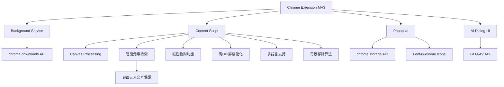

# 精準截圖 - AI時代的首款智能截圖工具

[English](README_EN.md) | 繁體中文 | [简体中文](README.md)

## 項目概述
"精準截圖"是一款Chrome瀏覽器外掛，旨在解決用戶在網頁截圖時需要頻繁調整截圖區域比例的問題。該外掛允許用戶預先設定截圖比例，然後進行連續截圖操作，每次截圖都會自動保持所選比例，大大提高截圖效率。該外掛界面美觀，操作簡單，適合各類用戶使用。


## 快速開始

### 1. 安裝
- **Chrome應用商店安裝**
  - 訪問 [Chrome應用商店 - 精準截圖](https://chromewebstore.google.com/detail/%E7%B2%BE%E5%87%86%E6%88%AA%E5%9B%BE-%E4%B8%80%E9%94%AE%E6%99%BA%E8%83%BD%E7%B2%BE%E5%87%86%E6%88%AA%E5%9B%BE%E5%B7%A5%E5%85%B7/mebflgmmheidlmggndpkkodonedongin?authuser=0&hl=zh-CN)
  - 點擊"添加至Chrome"按鈕完成安裝

- **開發者模式安裝**
  - 下載本項目代碼並解壓
  - 打開Chrome瀏覽器，訪問 `chrome://extensions/`
  - 開啟右上角的"開發者模式"
  - 點擊"加載已解壓的擴展程序"，選擇解壓後的文件夾

### 2. 基本使用
1. **啟動截圖**
   - 點擊瀏覽器工具欄中的精準截圖圖標
   - 或使用快捷鍵 `Ctrl+Shift+S`

2. **選擇截圖模式**
   - 普通模式：選擇預設比例（1:1、16:9等）
   - 智能模式：自動識別網頁元素邊界

3. **截圖操作**
   - 滑鼠點擊並拖動選擇區域
   - 調整大小：拖動邊框或角落的調整點
   - 移動位置：拖動選區中心區域
   - 確認截圖：點擊工具欄的"保存"按鈕或按Enter鍵
   - 取消截圖：按Esc鍵

### 3. 進階功能
- **磁性吸附**：靠近元素邊緣時自動吸附，便於精確選擇
- **鎖定尺寸**：批量截取相同大小的圖片
- **二維碼解析**：識別並複製二維碼內容
- **AI對話**：與截圖內容進行智能對話
- **背景移除**：一鍵去除圖片背景
- **快速分享**：一鍵分享截圖到社交媒體
- **快速反饋**：提供產品使用反饋

### 4. 快捷鍵
- `Ctrl+Shift+S`：啟動截圖
- `Enter`：確認截圖
- `Esc`：取消截圖
- `Ctrl+C`：複製截圖到剪貼板

## 目標用戶
- 設計師：需要獲取特定比例的素材
- 內容創作者：需要為不同平台準備固定比例的圖片
- 電商賣家：需要製作統一規格的產品圖片
- 社交媒體運營：需要為不同平台準備符合規格的圖片

## 核心功能
### 1. 比例設置
- ✅ 預設常用比例，按分組整理：
  - 常用比例：16:9 (視頻/屏幕)、4:3 (傳統屏幕)、1:1 (正方形/Instagram)
  - 移動設備：9:16 (手機豎屏/故事)、3:4 (小紅書/iPad)
  - 社交媒體：2:1 (小紅書/Twitter橫圖)、1:2 (Pinterest)、4:5 (Instagram豎圖)、3:2 (SNS封面)
  - 其他：21:9 (超寬屏)、自由比例
- ✅ 支持用戶自定義比例輸入
- ✅ 記住用戶最近使用的比例設置
- ✅ 支持自由比例模式

### 2. 截圖操作
- ✅ 用戶選擇比例後進入截圖模式
- ✅ 截圖區域自動保持所選比例
- ✅ 支持拖拽調整截圖區域大小（保持比例不變）
- ✅ 支持移動截圖區域位置
- ✅ 顯示當前截圖區域的尺寸信息
- ✅ 支持連續截圖，無需退出截圖模式即可截取多張圖片
- ✅ 智能元素檢查模式，自動識別網頁元素邊界
- ✅ 支持鎖定截圖尺寸，方便批量截取相同大小的圖片
- ✅ 支持二維碼解析，一鍵識別並複製鏈接

### 3. 智能檢測功能
- ✅ 智能識別頁面元素邊界
- ✅ 懸停時自動高亮顯示元素尺寸
- ✅ 點擊即可精準截取UI組件
- ✅ 支持元素中心線對齊
- ✅ 智能過濾不可見元素
- ✅ 智能截圖模式下防止與頁面元素交互，保護截圖狀態不被破壞

### 4. 磁性吸附功能
- ✅ 自動吸附到頁面元素邊緣
- ✅ 可調整吸附強度
- ✅ 支持水平和垂直方向吸附
- ✅ 智能吸附閾值控制
- ✅ 平滑過渡動畫效果

### 5. 圖片保存
- ✅ 支持將截圖保存到本地
- ✅ 支持複製到剪貼板
- ✅ 支持連續截取的多張圖片預覽
- ✅ 可自定義圖片格式（PNG/JPG）和質量
- ✅ 支持高DPI屏幕優化

### 6. 二維碼功能
- ✅ 一鍵解析截圖中的二維碼
- ✅ 自動複製二維碼鏈接到剪貼板
- ✅ 支持各種常見二維碼格式
- ✅ 智能識別和定位二維碼位置
- ✅ 清晰的成功/失敗狀態提示

### 7. AI圖像對話
- ✅ 一鍵啟動AI對話模式，與截圖內容進行對話
- ✅ 基於GLM-4V大模型的圖像理解能力
- ✅ 支持用戶提問和多輪對話
- ✅ 可詢問圖像內容、文字解釋、代碼分析等
- ✅ 簡潔美觀的對話界面，支持Markdown格式顯示

### 8. 背景移除
- ✅ 一鍵移除圖像背景，生成透明背景圖片
- ✅ 內置簡單的背景分析算法
- ✅ 適用於產品、物體等簡單背景圖像
- ✅ 處理完成後直接複製到剪貼板
- ✅ 保留前景對象的清晰邊緣

### 9. 用戶界面
- ✅ 簡潔直觀的界面設計，帶有漸變色標題區和精美陰影效果
- ✅ 截圖時顯示半透明遮罩和高亮選框
- ✅ 顯示當前比例和尺寸信息
- ✅ 提供清晰的操作提示
- ✅ 支持多語言界面
- ✅ 快速分享和反饋按鈕，方便用戶互動

### 10. 快捷鍵支持
- ✅ 啟動外掛快捷鍵: Ctrl+Shift+S
- ✅ 截圖操作的快捷鍵（確認、取消）
- ✅ 支持ESC鍵快速取消截圖
- ✅ 支持Ctrl+C複製截圖到剪貼板
- ✅ 支持連續截圖模式切換

## 技術實現
- 使用Chrome擴展MV3架構開發
- 權限使用：activeTab, downloads, scripting, tabs, storage, clipboardWrite
- 使用Canvas技術處理圖像並保持比例
- 使用Chrome Storage API存儲用戶設置
- 針對不同DPI屏幕進行優化
- 智能元素檢測算法
- 磁性吸附算法
- 平滑動畫過渡效果
- 簡單的背景移除算法實現
- 與GLM-4V API集成實現AI對話功能
- 智能截圖交互保護層：在智能檢測模式下保持元素識別的同時防止意外交互
- 採用FontAwesome圖標庫提供豐富的界面圖標

## 項目結構
```
├── manifest.json       # 擴展清單文件
├── assets/            # 圖標和資源文件
│   └── fontawesome/   # FontAwesome圖標庫
├── background/        # 後台服務腳本
├── content/           # 內容腳本(截圖核心邏輯)
├── popup/             # 彈出窗口界面
├── utils/             # 工具函數
│   └── i18n.js        # 國際化支持
├── ai_dialog/         # AI對話界面
└── _locales/          # 多語言支持
```

## 技術架構


## 快捷鍵
| 功能 | 快捷鍵 |
|------|--------|
| 啟動截圖 | Ctrl+Shift+S |
| 確認截圖 | Enter |
| 取消截圖 | Esc |
| 複製截圖 | Ctrl+C |
| 打開外掛 | 點擊工具欄圖標 |
| 切換連續截圖模式 | 工具欄按鈕 |
| 切換磁性吸附 | 工具欄按鈕 |
| 鎖定截圖尺寸 | 工具欄按鈕 |

## 開源協議
本項目採用 [CC BY-NC-ND 4.0](https://creativecommons.org/licenses/by-nc-nd/4.0/) 開源協議。

### 協議要點
- ✅ 必須保留原作者署名
- ❌ 禁止商業使用
- ❌ 禁止修改和再分發修改版
- 📝 任何使用均需獲得作者授權

### 使用授權
如需商業使用本項目，請聯繫作者獲取授權。未經授權的任何商業使用行為都將被視為侵權。

如果你喜歡我的內容，並且想要給予一些鼓勵和支持，歡迎點擊 [Buy Me a Coffee](https://buymeacoffee.com/zhushen) 請我喝一杯咖啡！🎉☕

## 增值功能計劃
為了進一步提升用戶體驗，"精準截圖"計劃逐步推出以下增值功能：

### 已實現功能
1. **智能背景移除**
   - ✅ 自動識別並移除單色背景
   - ✅ 保留前景內容，生成透明結果
   - ✅ 適合製作產品素材和設計元素
   
2. **AI圖像對話**
   - ✅ 基於GLM-4V的圖像理解能力
   - ✅ 支持多輪對話和內容分析
   - ✅ 圖像相關問答和內容解釋

### 近期規劃功能
3. **複刻UI組件**
   - 從截圖中提取頁面結構
   - 接入AI Agent進行UI組件複刻
   - 實時瀏覽複刻進程

4. **爆款文案仿寫**
   - 從截圖中提取文本內容
   - 接入AI Agent進行文案仿寫
   - 實時瀏覽仿寫內容

### 中期規劃功能
5. **圖像超分辨率**
   - 提升截圖清晰度和分辨率
   - 支持2x、4x倍率選擇
   - 適合需要高質量圖像的場景

6. **圖片翻譯**
   - 識別圖片中的文字並翻譯
   - 支持多語言互譯
   - 保持原始布局和樣式

### 長期規劃功能
7. **高級智能摳圖**
   - 高級背景移除和對象提取
   - 保留複雜邊緣細節
   - 一鍵生成專業摳圖效果

8. **一鍵美化**
   - 自動優化圖片參數
   - 智能調整亮度、對比度、飽和度
   - 適合社交媒體分享

### 會員計劃展望
未來我們計劃推出不同級別的會員服務，以滿足不同用戶的需求：
- **基礎版**：保留現有所有功能，永久免費
- **增強版**：包含OCR和透明底等基礎增值功能
- **專業版**：包含全部高級功能，適合專業創作者

如果您對某項功能特別感興趣或有其他功能建議，歡迎通過issues反饋！

## API密鑰配置
本項目使用GLM-4V API進行圖像分析和AI對話功能。要使用此功能，你需要配置API密鑰：

1. 複製 `config.example.js` 為 `config.local.js`
2. 在 `config.local.js` 中填入你的GLM-4V API密鑰
3. 確保 `config.local.js` 已添加到 `.gitignore` 中（默認已添加）

注意：不要將你的API密鑰提交到GitHub倉庫中。如果你不小心提交了API密鑰，請立即更改它。

## Star History
覺得好用，點個星吧⭐⭐⭐
[](https://www.star-history.com/#zhushen12580/short&Date) 