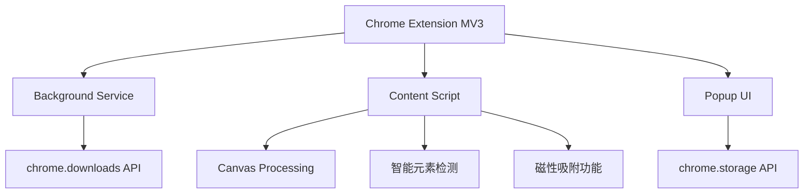

# 精准截图 - 一款更懂内容创作者的一键智能精准截图工具

## 项目概述
"精准截图"是一款Chrome浏览器插件，旨在解决用户在网页截图时需要频繁调整截图区域比例的问题。该插件允许用户预先设定截图比例，然后进行连续截图操作，每次截图都会自动保持所选比例，大大提高截图效率。

## 目标用户
- 设计师：需要获取特定比例的素材
- 内容创作者：需要为不同平台准备固定比例的图片
- 电商卖家：需要制作统一规格的产品图片
- 社交媒体运营：需要为不同平台准备符合规格的图片

## 核心功能
### 1. 比例设置
- ✅ 预设常用比例（1:1、4:3、16:9、3:4、9:16等）
- ✅ 支持用户自定义比例输入
- ✅ 记住用户最近使用的比例设置

### 2. 截图操作
- ✅ 用户选择比例后进入截图模式
- ✅ 截图区域自动保持所选比例
- ✅ 支持拖拽调整截图区域大小（保持比例不变）
- ✅ 支持移动截图区域位置
- ✅ 显示当前截图区域的尺寸信息
- ✅ 支持连续截图，无需退出截图模式即可截取多张图片
- ✅ 新增！智能元素检查模式，自动识别网页元素边界

### 3. 图片保存
- ✅ 支持将截图保存到本地
- ✅ 支持复制到剪贴板
- ✅ 支持连续截取的多张图片预览
- ✅ 可自定义图片格式（PNG/JPG）和质量

### 4. 用户界面
- ✅ 简洁直观的操作界面
- ✅ 截图时显示半透明遮罩和高亮选框
- ✅ 显示当前比例和尺寸信息
- ✅ 提供清晰的操作提示

### 5. 快捷键支持
- ✅ 启动插件快捷键: Ctrl+Shift+S
- ✅ 截图操作的快捷键（确认、取消）
- ✅ 支持ESC键快速取消截图

## 高级功能
### 1. 智能检测功能
- ✅ 智能识别页面元素边界
- ✅ 悬停时自动高亮显示元素尺寸
- ✅ 点击即可精准截取UI组件

### 2. 磁性吸附功能
- ✅ 自动吸附到页面元素边缘
- ✅ 辅助对齐指导线
- ✅ 可调整吸附强度

### 3. 可视化增强
- ✅ 尺寸实时显示
- ✅ 操作指导提示
- ✅ 截图预览缩略图

## 技术实现
- 使用Chrome扩展MV3架构开发
- 权限使用：activeTab, downloads, scripting, tabs, storage
- 使用Canvas技术处理图像并保持比例
- 使用Chrome Storage API存储用户设置
- 针对不同DPI屏幕进行优化

## 项目结构
```
├── manifest.json       # 扩展清单文件
├── assets/             # 图标和资源文件
├── background/         # 后台服务脚本
├── content/            # 内容脚本(截图核心逻辑)
├── popup/              # 弹出窗口界面
└── utils/              # 工具函数
```

## 项目状态
✅ 已完成核心功能开发（v1.0.0）  
✅ 完成智能元素检测功能开发  
✅ 完成磁性吸附功能实现  
✅ 通过基础功能测试和兼容性测试  
🔄 正在准备Chrome应用商店发布材料

## 技术架构


## 快捷键
| 功能 | 快捷键 |
|------|--------|
| 启动截图 | Ctrl+Shift+S |
| 确认截图 | Enter |
| 取消截图 | Esc |
| 打开插件 | 点击工具栏图标 |

## 开源协议
本项目采用 [Creative Commons Attribution-NonCommercial-NoDerivatives 4.0 International License (CC BY-NC-ND 4.0)](https://creativecommons.org/licenses/by-nc-nd/4.0/) 开源协议。

### 协议要点
- ✅ 必须保留原作者署名
- ❌ 禁止商业使用
- ❌ 禁止修改和再分发修改版
- 📝 任何使用均需获得作者授权

### 使用授权
如需商业使用本项目，请联系作者获取授权。未经授权的任何商业使用行为都将被视为侵权。
