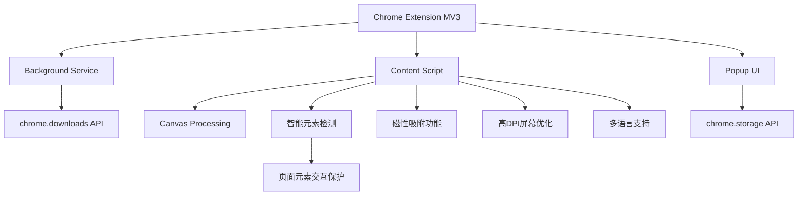

# 精准截图 - 一款更懂内容创作者的一键智能精准截图工具


## 项目概述
"精准截图"是一款Chrome浏览器插件，旨在解决用户在网页截图时需要频繁调整截图区域比例的问题。该插件允许用户预先设定截图比例，然后进行连续截图操作，每次截图都会自动保持所选比例，大大提高截图效率。


## 目标用户
- 设计师：需要获取特定比例的素材
- 内容创作者：需要为不同平台准备固定比例的图片
- 电商卖家：需要制作统一规格的产品图片
- 社交媒体运营：需要为不同平台准备符合规格的图片

## 核心功能
### 1. 比例设置
- ✅ 预设常用比例（1:1、4:3、16:9、3:4、9:16等）
- ✅ 支持用户自定义比例输入
- ✅ 记住用户最近使用的比例设置
- ✅ 支持自由比例模式

### 2. 截图操作
- ✅ 用户选择比例后进入截图模式
- ✅ 截图区域自动保持所选比例
- ✅ 支持拖拽调整截图区域大小（保持比例不变）
- ✅ 支持移动截图区域位置
- ✅ 显示当前截图区域的尺寸信息
- ✅ 支持连续截图，无需退出截图模式即可截取多张图片
- ✅ 智能元素检查模式，自动识别网页元素边界
- ✅ 支持锁定截图尺寸，方便批量截取相同大小的图片
- ✅ 支持二维码解析，一键识别并复制链接

### 3. 智能检测功能
- ✅ 智能识别页面元素边界
- ✅ 悬停时自动高亮显示元素尺寸
- ✅ 点击即可精准截取UI组件
- ✅ 支持元素中心线对齐
- ✅ 智能过滤不可见元素
- ✅ 智能截图模式下防止与页面元素交互，保护截图状态不被破坏

### 4. 磁性吸附功能
- ✅ 自动吸附到页面元素边缘
- ✅ 可调整吸附强度
- ✅ 支持水平和垂直方向吸附
- ✅ 智能吸附阈值控制
- ✅ 平滑过渡动画效果

### 5. 图片保存
- ✅ 支持将截图保存到本地
- ✅ 支持复制到剪贴板
- ✅ 支持连续截取的多张图片预览
- ✅ 可自定义图片格式（PNG/JPG）和质量
- ✅ 支持高DPI屏幕优化

### 6. 二维码功能
- ✅ 一键解析截图中的二维码
- ✅ 自动复制二维码链接到剪贴板
- ✅ 支持各种常见二维码格式
- ✅ 智能识别和定位二维码位置
- ✅ 清晰的成功/失败状态提示

### 7. 用户界面
- ✅ 简洁直观的操作界面
- ✅ 截图时显示半透明遮罩和高亮选框
- ✅ 显示当前比例和尺寸信息
- ✅ 提供清晰的操作提示
- ✅ 支持多语言界面

### 8. 快捷键支持
- ✅ 启动插件快捷键: Ctrl+Shift+S
- ✅ 截图操作的快捷键（确认、取消）
- ✅ 支持ESC键快速取消截图
- ✅ 支持连续截图模式切换

## 技术实现
- 使用Chrome扩展MV3架构开发
- 权限使用：activeTab, downloads, scripting, tabs, storage
- 使用Canvas技术处理图像并保持比例
- 使用Chrome Storage API存储用户设置
- 针对不同DPI屏幕进行优化
- 智能元素检测算法
- 磁性吸附算法
- 平滑动画过渡效果
- 智能截图交互保护层：在智能检测模式下保持元素识别的同时防止意外交互

## 项目结构
```
├── manifest.json       # 扩展清单文件
├── assets/            # 图标和资源文件
├── background/        # 后台服务脚本
├── content/           # 内容脚本(截图核心逻辑)
├── popup/             # 弹出窗口界面
├── utils/             # 工具函数
└── _locales/          # 多语言支持
```

## 技术架构


## 快捷键
| 功能 | 快捷键 |
|------|--------|
| 启动截图 | Ctrl+Shift+S |
| 确认截图 | Enter |
| 取消截图 | Esc |
| 打开插件 | 点击工具栏图标 |
| 切换连续截图模式 | 工具栏按钮 |
| 切换磁性吸附 | 工具栏按钮 |
| 锁定截图尺寸 | 工具栏按钮 |

## 开源协议
本项目采用 [CC BY-NC-ND 4.0](https://creativecommons.org/licenses/by-nc-nd/4.0/) 开源协议。

### 协议要点
- ✅ 必须保留原作者署名
- ❌ 禁止商业使用
- ❌ 禁止修改和再分发修改版
- 📝 任何使用均需获得作者授权

### 使用授权
如需商业使用本项目，请联系作者获取授权。未经授权的任何商业使用行为都将被视为侵权。

如果你喜欢我的内容，并且想要给予一些鼓励和支持，欢迎点击 [Buy Me a Coffee](https://buymeacoffee.com/zhushen) 请我喝一杯咖啡！🎉☕

## 增值功能计划
为了进一步提升用户体验，"精准截图"计划逐步推出以下增值功能：

### 近期规划功能
1. **OCR文本提取**
   - 从截图中提取文字内容
   - 支持复制到剪贴板
   - 识别多种语言文本

2. **图片透明底处理**
   - 自动识别并移除单色背景
   - 保留前景内容，生成透明PNG
   - 适合制作产品素材和设计元素

### 中期规划功能
3. **图像超分辨率**
   - 提升截图清晰度和分辨率
   - 支持2x、4x倍率选择
   - 适合需要高质量图像的场景

4. **图片翻译**
   - 识别图片中的文字并翻译
   - 支持多语言互译
   - 保持原始布局和样式

### 长期规划功能
5. **智能抠图**
   - 高级背景移除和对象提取
   - 保留复杂边缘细节
   - 一键生成专业抠图效果

6. **一键美化**
   - 自动优化图片参数
   - 智能调整亮度、对比度、饱和度
   - 适合社交媒体分享

7. **批量处理工作流**
   - 对多张截图应用相同处理
   - 自定义处理流程
   - 提高内容创作效率

### 会员计划展望
未来我们计划推出不同级别的会员服务，以满足不同用户的需求：
- **基础版**：保留现有所有功能，永久免费
- **增强版**：包含OCR和透明底等基础增值功能
- **专业版**：包含全部高级功能，适合专业创作者

如果您对某项功能特别感兴趣或有其他功能建议，欢迎通过issues反馈！

## API密钥配置
本项目使用GLM-4V API进行图像分析。要使用此功能，你需要配置API密钥：

1. 复制 `config.example.js` 为 `config.local.js`
2. 在 `config.local.js` 中填入你的GLM-4V API密钥
3. 确保 `config.local.js` 已添加到 `.gitignore` 中（默认已添加）

注意：不要将你的API密钥提交到GitHub仓库中。如果你不小心提交了API密钥，请立即更改它。
