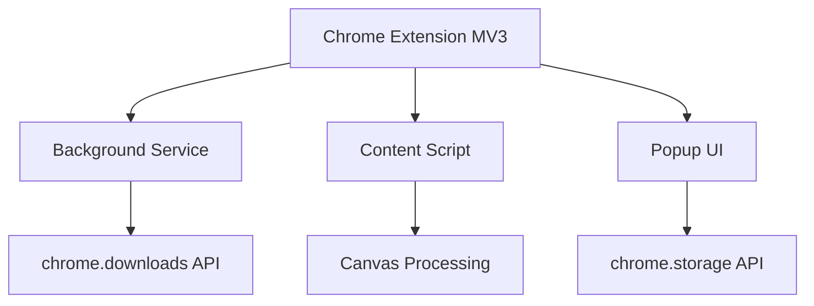

## 项目概述
"精确截图"是一款Chrome浏览器插件，旨在解决用户在网页截图时需要频繁调整截图区域比例的问题。该插件允许用户预先设定截图比例，然后进行连续截图操作，每次截图都会自动保持所选比例，大大提高截图效率。

## 目标用户
- 设计师：需要获取特定比例的素材
- 内容创作者：需要为不同平台准备固定比例的图片
- 电商卖家：需要制作统一规格的产品图片
- 社交媒体运营：需要为不同平台准备符合规格的图片
## 核心功能需求
### 1. 比例设置
- 预设常用比例（1:1、4:3、16:9、3:4、9:16等）
- 支持用户自定义比例输入
- 记住用户最近使用的比例设置
### 2. 截图操作
- 用户选择比例后进入截图模式
- 截图区域自动保持所选比例
- 支持拖拽调整截图区域大小（保持比例不变）
- 支持移动截图区域位置
- 显示当前截图区域的尺寸信息
- 支持连续截图，无需退出截图模式即可截取多张图片
### 3. 图片保存
- 支持将截图保存到本地
- 支持复制到剪贴板
- 支持批量下载连续截取的多张图片
- 可自定义图片格式（PNG/JPG）和质量
### 4. 用户界面
- 简洁直观的操作界面
- 截图时显示半透明遮罩和高亮选框
- 显示当前比例和尺寸信息
- 提供清晰的操作提示
### 5. 快捷键支持
- 启动插件的快捷键
- 截图操作的快捷键（确认、取消、调整等）
- 支持自定义快捷键
## 可选功能（未来迭代）
### 1. 截图编辑
- 基础编辑功能（裁剪、旋转、调整亮度/对比度）
- 添加标注（箭头、文字、形状等）
- 模糊/马赛克工具
### 2. 高级保存选项
- 云存储集成（Google Drive、Dropbox等）
- 一键分享到社交媒体
- 图片命名规则设置
### 3. 高级截图功能
- 全页面截图
- 延时截图
- 滚动截图（捕获长页面）
## 技术要求
- 使用Chrome扩展API开发
- 需要activeTab权限捕获页面内容
- 使用canvas处理图像并保持比例
- 使用chrome.storage API存储用户设置
- 确保在不同DPI屏幕上正常工作
## 隐私与安全
- 明确说明插件所需权限及用途
- 不收集用户个人数据
- 截图内容仅在本地处理，不上传至服务器
## 成功指标
- 用户安装量
- 活跃用户数
- 用户评分和评价
- 功能使用频率（哪些比例最常用等）

## 项目状态
✅ 已完成核心功能开发（v1.0.0）  
✅ 通过基础功能测试和兼容性测试  
🔄 正在准备Chrome应用商店发布材料

## 已实现功能
### 核心功能
- [✅] 智能比例截图（预设比例+自定义比例）
- [✅] 连续截图模式
- [✅] 拖拽调整截图区域
- [✅] 本地保存/剪贴板复制
- [✅] 用户设置存储（使用<mcfile name="helpers.js" path="d:\PRODUCT\比例截图\utils\helpers.js"></mcfile>）

### 用户界面
- [✅] 响应式弹出窗口（<mcfile name="popup.html" path="d:\PRODUCT\比例截图\popup\popup.html"></mcfile>）
- [✅] 实时尺寸显示
- [✅] 操作提示系统
- [✅] 快捷键支持（Ctrl+Shift+1 启动）

## 技术架构
